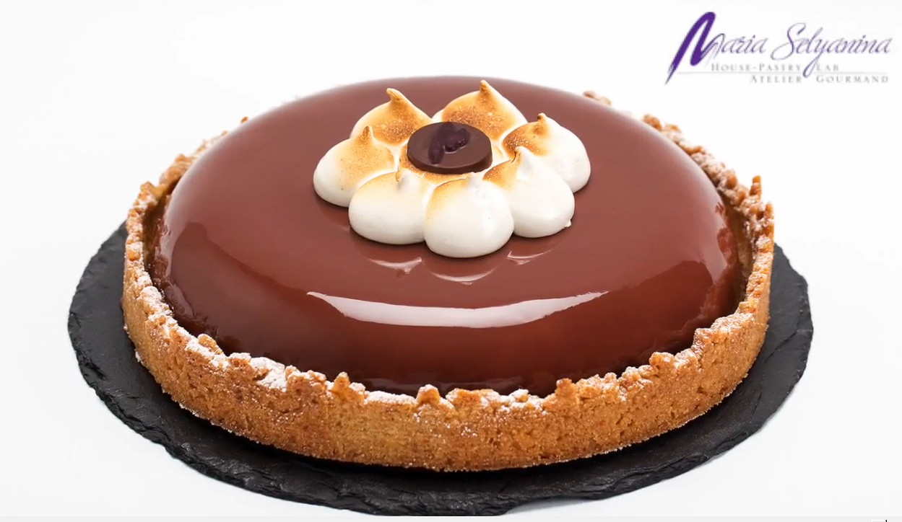

# Торт Noche Jerezana Guinness

Торт Noche Jerezana Guinness создан на базе одноименного коктейля от Javier de las Muelas основателя и владельца сети Dry Martini.  
В состав коктейля входят пиво Guinness, херес Noe Pedro Ximenez 30 летней выдержки, апельсиновaя
цедра и мускатный орех. В нижней части торта находится бисквит в состав которого входит пиво Guinnеss. Это традиционный, классический ирландский бисквит. Затем расположено кремe из красного апельсина с розовым перцем и мускатным орехом. Желе с Noe Pedro Ximenez и мусс из белого шоколада с пивом Guinness и
хересом Pedro Ximenez. Декор напоминает пену на пивной кружке.

#### Ингредиенты:
на 1 торт форма 18 см * 5 см, вкладыш 14 см

**для ирландского бисквита:** на форму 30 * 40 * 1 см
* пиво Guinness 125 г
* сливочное масло 125 г
* мука 125 г
* какао-порошок 37 г
* сода 5 г
* сахар 100 г
* сахар мусковадо лайт 100 г
* розовый перец 2,5 г
* цедра половины апельсина
* сметана >30% 70 г
* яйца 60 г

**для креме из красного апельсина:**
* пюре красного апельсина 50 г
* концентрат красного апельсина 20 или пюре красного апельсина 10 г
* цедра четверти апельсина
* розовый перец 2 г
* мускатный орех 0,2 г
* желтки 40 г
* яйца 46 г
* сахар 42 г
* сливочное масло 48 г
* желатин 1,6 г

**для желе из Pedro Ximenez:**
* вода 33 г
* Noe Pedro Ximenez 33 г
* сироп глюкозы 16 г
* сахар 16 г
* пектин NH 3 г
* желатин 1 г

**для мусса на пиве Guinness:**
* пиво Guinness 117 г
* желтки 35 г
* сахар 14 г
* желатин 7 г
* херес Pedro Ximenez 7 г
* белый шоколад Valrhona Ivoire 35% 94 г 
  или белый шоколад 28% 108 г + какао-масло 4 г
* сливки 35% 188 г

**для меренги:**
* пиво Guinness 66 г
* альбумин 6 г
* сахар 66 г
* сахарная пудра 50 г
* ксантановая камедь 0,5 г

**для короны из крамбла:**
* миндальная мука 50 г
* коричневый сахар 50 г
* сливочное масло 50 г
* цедра трети апельсина
* розовый перец 0,5 г

**для черной глазури:** - за 24 ч.
* сироп глюкозы 16 г
* декстроза 47 г
* вода 16 г
* сливки 35% 70 г
* сахар 136 г
* какао-порошок 54 г
* сухое молоко 8 г
* желатин 8,5 г
* нейтральная глазурь 146 г

#### Приготовление

**Приготовить бисквит.** В сотейнике нагреть пиво и масло, нарезанное кубиком, на очень низком огне до того момента, как масло растопится почти полностью. Снять с плиты и оставить масло растворяться остаточным теплом, перемешать, остудить до 45-50 ºС. Перелить в чашу.

Смолоть розовый перец. Просеять муку на лист пекарской бумаги, просеять туда же какао, добавить соду, оба сахара, не просеивая, натереть свежую цедру. Смешать руками в перчатках, растирая комочки сахара.  
Смешать сметану с яйцами венчиком в однородную смесь. Добавить в остуженное пиво, смешать до однородности.

Добавить в массу сухие ингредиенты, смешать венчиком, тесто должно быть очень жидким. Оставить на 10- 15 минут, чтобы мука пропиталась (не нужно, если выпекать в силиконовой форме). Выложить на силиконовый коврик 30х40х1см, выпекать при 180 ºС в течение 10 минут. Накрыть пленкой и остудить при комнатной температуре. Остывший бисквит перевернуть и вынуть из формы. Вырезать из бисквита диск 14 см с помощью кольца и вложить в кольцо с ацетатной пленкой, аккуратно, тк бисквит ломается. Заморозить.

**Приготовить креме.** Замочить желатин в ледяной воде. Выложить в сотейник пюре, размороженное комнатной температуры. Смешать отдельно яйца с желтками и сахаром. Добавить яичную смесь к пюре, нагреть средне низком огне до 82-83ºС, постоянно помешивая, снимать со дна. Сразу снять с огня по достижении нужной температуры, перелить в другую посуду, добавить замоченный и выжатый желатин. Пробить блендером. Остудить до 45ºС, добавить свеженатертую цедру, мускатный орех, розовый перец, холодное масло кубиками из холодильника и пробить ручным блендером до получения однородной массы. Вылить из кувшина поверх замороженного бисквита 230 г креме, заморозить.

**Приготовить желе.** В сотейник налить воду, херес, подогретый сироп глюкозы. Смешать пектин с сахаром. Замочить желатин в ледяной воде.

Нагреть на низком огне до 40ºС, добавить сахар смешанный с пектином дождиком, хорошо помешивая венчиком. Вернуть на огонь, продолжая помешивать, довести до кипения, прокипятить одну минуту. Снять с огня, добавить отжатый желатин, немного остудить и выложить поверх хорошо замороженного креме слоем 5 мм. Заморозить.

Замороженный центр торта вынуть из кольца, слегка сгладить верх маленьким ножом, если нужно. Поставить в морозилку без формы, но с пленкой до момента сборки торта.

**Приготовить мусс.** Взбить холодные сливки, оставить в холодильнике. Замочить желатин в ледяной воде. Выложить шоколад в кувшин.

Приготовить крем англез из пива. Перелить пиво в сотейник, добавить сахар, нагреть до закипания. Снять с огня, добавить немного в желтки, смешать, вылить желтки в пиво, проварить до 82С на слабом огне, хорошо помешивая. 

Перелить 96 г крема в отдельную посуду и добавить в него отжатый желатин, перемешать венчиком. Перелить часть крема в кувшин с подготовленным шоколадом, оставить на 30 секунд, чтобы растопить шоколад, затем пробить блендером в эмульсию, постепенно добавляя остальной крем. Добавить херес, продолжить пробивать. Проверить температуру не выше 35-38С. 

В чашу со сливками из холодильника добавить эмульсию и смешать круговыми движениями, поворачивая чашу до однородности. Температура итоговой смеси чуть выше 26С , чтобы какао-масло не начало застывать.

Подготовить форму к сборке. Налить часть мусса в форму половником, распределяя равномерно, по половины формы. Достать торт из морозилки в последний момент и установить в центр формы, бисквит вровень с верхом формы. Выровнять спатулой края мусса.  Заморозить.

**Приготовить глазурь.** Замочить желатин в ледяной воде. Объединить в ковшике сливки, воду, сухое молоко (для смягчения вкуса шоколада), сахар, сироп глюкозы (для блеска), декстрозу. Нагреть на среднем огне, помешивая венчиком, довести до кипения.

Подготовить отжатый желатин. Добавить **просеянный** какао-порошок, тщательно размешать, продолжить нагревать до однородности, помешивая венчиком, довести до кипения. Сразу же добавить желатин и перемешать, пробить блендером на средне-низкой скорости, не добавляя воздуха под наклоном 45 градусов не шевеля блендер.

Добавить всю нейтральную глазурь, пробить блендером на средне-низкой скорости, не добавляя воздуха. Дать стабилизироваться в холодильнике 24 часа.

Перед употреблением нагреть до 40С в микроволновке, не помешивая много, пробить блендером, глазировать по замороженной поверхности. Глазировать при температуре 35-38С. Хранить не более месяца в плотно закрытом контейнере.

**Приготовить корону из крамбла.** Поместить все ингредиенты в часу миксера и смешать (насадка лопатка). Скатать тесто в
колбаски и заморозить. Натереть тесто на терке и сделать "корону”, выпекать при 150ºС.

Собрать торт. 

**Приготовить меренгу для декора.** Смешать альбумин с пивом и ксантановой камедью. Пробить ручным блендером до получения
однородной смеси. Взбивать смесь в течение 5 минут постепенно добавляя сахар. В конце
добавить сахарную пудру и продолжать взбивать еще 5 минут

