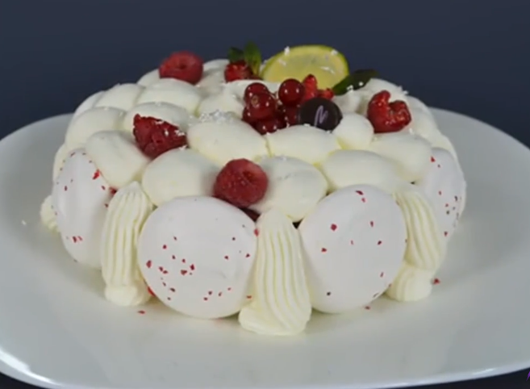

# Вашрен (Vacherin)

Вашрен - это классический десерт, предполагающий множество вариаций, но его основной идеей будет комбинировать базу из меренги с кремом или мороженым различных вкусов и кремом Шантильи. Идеей создания десерта в свое время стал одноименный французский сыр, и классический аспект этого торта частично передает круглый, белый и мягкий сыр Вашрен.
В Книге "Larousse de Cuisine” 1984 года издания, говорится о концепте "Vacherin Glacé”, и на сегодняшний день это самая подробная версия этого десерта. В настоящее время, когда говорится "Vacherin”, всегда подразумевается мороженое. Десерт vacherin glacé предлагается в известных кондитерских и ресторанах Франции, и его вторым распространенным именем является l'Hymalaya.

#### Ингредиенты

на кольцо 16-18 см высотой 4,5 см

* 1 порция [Французской меренги](https://mars9n9.github.io/cakes/Базовый/Меренги/french_meringue.html)
* 300 г. лаймового мороженого
* 300 г. малинового мороженого
* 500 г [крема Шантильи](https://mars9n9.github.io/cakes/%D0%91%D0%B0%D0%B7%D0%BE%D0%B2%D1%8B%D0%B9/%D0%91%D0%B0%D0%B7%D0%BE%D0%B2%D1%8B%D0%B5%20%D0%BA%D1%80%D0%B5%D0%BC%D1%8B/chantilly.html)

#### Процесс

Выложить 2 диска из меренги нужного размера (16-18 см в диаметре) с помощью круглой насадки 8 мм и круглые меренги 4,5 см в диаметре или овалы с помощью круглой насадки 10-12 мм.  
Выпекать в духовке при 90 ºC 2-2.30 часа или высушить в дегидраторе.  
Украсить шелухой розового перца

**Сборка и украшение**

Проложить кольцо 16-18x4.5 см ацетатной пленкой. Все инструменты для работы (кольца, силиконовая спатула, скребок, кондитерский мешок и насадка) с мороженым должны быть заморожены, чтобы не нарушить правильную текстуру мороженого.  
Положить первый диск высушенной меренги на дно формы, заморозить.  
Переложить мороженое в кондитерский мешок с насадкой 14-16 мм гладкая, выложить первый слой мороженого. Закрыть другим диском безе. Выложить второй слой мороженого, сгладить спатулой, заморозить.  
Взбить крем Шантильи.  
Вынуть торт из формы, выложить на тарелку, снять пленку. Нагреть нейтральную глазурь, приклеить меренги, оставив по 1 см пространства между ними.  
Заполнить промежутки между безе с взбитыми сливками с помощью насадки 12 мм резная и верхнюю поверхность торта насадкой Сент-Оноре, чтобы мороженое не было видно.  
Украсить свежей малиной и лаймом.  
Хранить в морозилке, подавать при tº -11C.  
