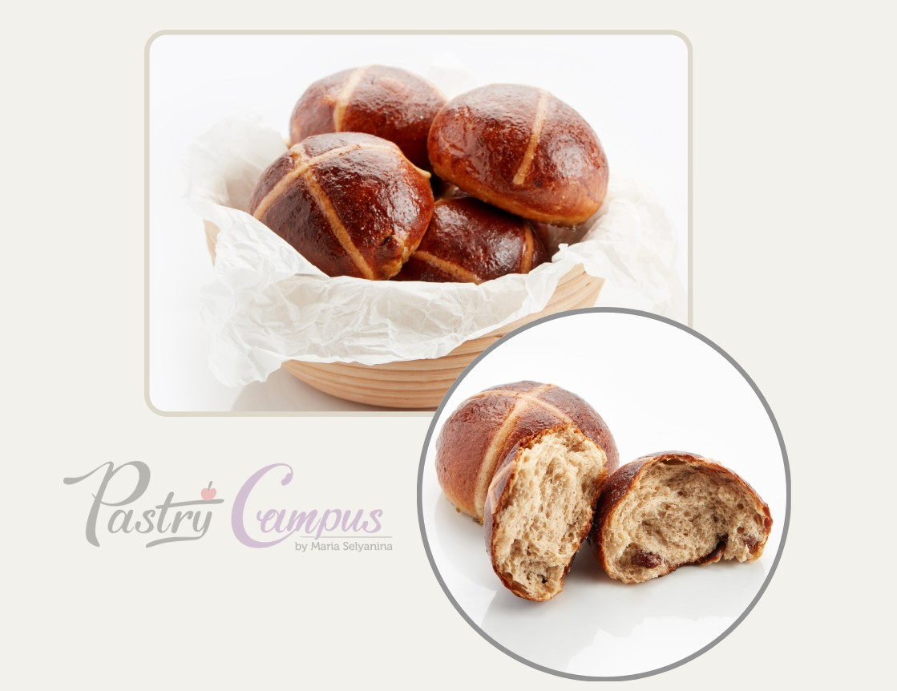

# Английские крестовые булочки. English hot cross buns

#### Ингредиенты
на 15 булочек по 70 г

**для опары:**  
за 12-24 часа

* 100 г цельного молока (теплого)
* 150 г сильной муки
* 10 г свежих дрожжей
* 10 г сахара

**для заварки тан жонг:**
за 2-3 часа

* 250 г молока (холодного)
* 50 г муки (обычной)

**для первого замеса:**

* весь Танг Жонг
* вся опара
* 300 г хлебной муки средней силы или сильной
* 5 г соли
* 50 г сахара
* 25 г сухого молока 26%
* 40 г сливочного масла
* 2,5 г хлебного улучшителя (опц.)
* 40 г желтков

**для второго замеса:**

* 15 г свежих дрожжей
* 10-15 г воды (если нужно)
* 30 г [“духов для выпечки”](https://mars9n9.github.io/cakes/%D0%9F%D1%80%D0%BE%D1%84%20%D1%80%D0%B5%D1%86%D0%B5%D0%BF%D1%82%D1%8B/%D0%A0%D0%B0%D0%B7%D0%BD%D0%BE%D0%B5/perfume.html)
* 175 г изюма в роме или виски

**для рисования узоров:**

* 50 г муки
* 50 г воды
* 10 г растительного масла

**для сиропа для пропитки:**
* 100 г воды
* 100 г сахара
* 30 г воды цветков апельсина
* 20 г темного рома

#### Процесс

Изюм замочить в роме **за 12 часов** или больше. Перед использованием просушить.

Приготовить опару **за 12 - 24 часа**: Растворить сахар в теплом молоке, смешать венчиком, добавить дрожжи, размешать венчиком. Добавить муку всю сразу, смешать до однородности, чтобы не было сухих вкраплений. Расстоять в теплом месте при 25-30ºC 1-2 часа (пулиш должен максимально подняться и
опуститься). Закрыть пленкой, убрать в холодильник на 12-24 часа, минимум на 4 часа.

Приготовить заварку: Смешать все ингредиенты в ковшике в холодном виде, хорошо размешать венчиком, чтобы не было комочков. На маленьком огне нагревать, помешивая венчиком, снимать со дна. Чем медленне нагрев, тем лучше заваривается крахмал. Ориентироваться на пар от молока и загустение, не контролировать термометром, довести до 65ºC. Переложить в другую емкость, накрыть пленкой вконтакт, остудить до комнатной температуры, затем остудить в холодильнике.

Замес и выпечка **на все 4 ч**: Выложить в чашу миксера или тестомеса все ингредиенты первой части теста в следующем порядке: мука, сухое молоко, соль, сахар, сливочное масло, опара, заварка, желтки. Начать замес насадкой крюк на низкой скорости миксера. Дать тесту смешаться 5 минут и оставить отдыхать на 1 час в холодильнике прямо в чаше, накрыв пленкой для увлажнения. 

Просушить изюм пока идет аутолиз.

Продолжить замес на низкой скорости до развития клейковины 10-15 минут. Температура теста - 24-25ºC. Если выше, охладить в холодильнике.

Добавить духи, дать им распределиться равномерно. Добавить дрожжи, слегка раскрошив их, добавить несколько капель воды чтобы помочь дрожжам интегрироваться, замес 1-2 минуты. Идеальная температура теста - 22-24ºC. Добавить просушенный изюм весь целиком, вмешать, но долго не мешать. Температура не выше 25ºC.

Выложить тесто в контейнер, смазанный маслом, вынимать из чаши руками в масле. Руками распределить изюм равномерно, сформовать тесто в плотный шар, закрыть пленкой вконтакт. Дать тесту отдохнуть на столе 1 час.

Руками в масле выпустить газ, сплющив на доске. Разделить на кусочки по 70 г, распластать каждый кусочек, собрать в шар, округлить. Оставить для отдыха на 5 минут.

Сформировать изделия: чуть приплюснуть, сгладить в аккуратные шарики в несколько приемов, не перегревая. Поставить на расстойку на противне 24 - 26ºC, 75 % влажности в течение 40 минут, на противень 30х40 - 8 штук.

Приготовить смесь для рисования узоров, пока идет расстойка. Муку смешать с водой венчиком, добавляя муку постепенно, следя, чтобы не было комочков, до кремовой, держащей форму текстуры. Добавить растительное масло, переложить в кондитерский мешок, оставить при комнатной температуре.

Расстоянные булочки смазать смесью желтка + 10% воды + соль, дать впитаться 5 минут, смазать еще раз. Из мешка выложить узоры.

Выпекать с камнем и паром, без конвекции при 220ºC, выпечка около 10 - 12 минут, проверить через 7 минут. Температура внутри при готовности 92ºC. Остудить на решетке. 

Сбрызнуть Куантро или др. ароматным ликером из пульверизатора поверхность свежеиспеченных изделий. При желании пропитать сиропом.

Готовые изделия можно замораживать в вакуумном пакете. Размораживать при комнатной температуре, затем подрумянить при 180ºC.

_Автор: Мария Селянина_
