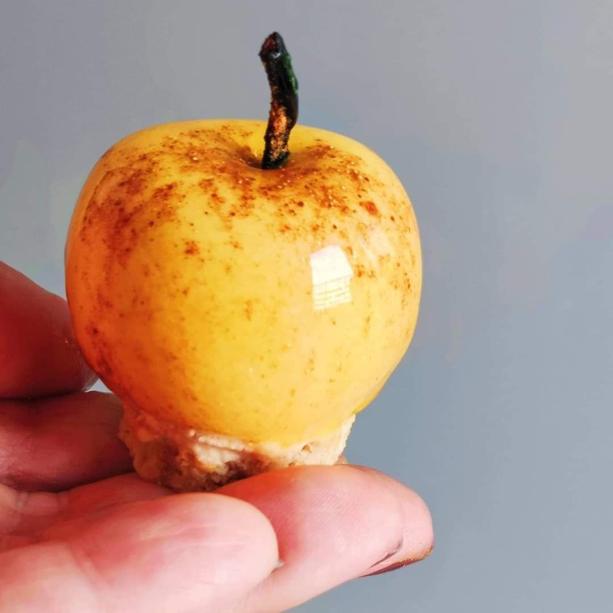

# Зеркальная глазурь на пектине. Веганская

#### Ингредиенты

* 13.4% сахара
* 13.4% сухой глюкозы Д.Э. 33 (декстрозный эквивалент 33, или сироп глюкозы)
* 0,6% пектина NH
* 0,1% камеди рожкового дерева
* 33% малинового пюре
* 39.5% воды

#### Процесс

Смешать вместе сахар, пектин, камедь рожкового дерева и глюкозу (если она сухая).

Нагреть пюре с водой (и глюкозой, если она в виде сиропа) до 45 градусов и, постоянно помешивая, добавить смесь сухих ингредиентов дождиком.

Довести до 85 градусов, продолжая мешать.
Снять с огня, накрыть плёнкой в контакт и убрать в холодильник хотя бы на 4 часа.

Нагреть до 40 градусов и использовать.

Можно нагреть ее до 70 градусов и распылить с помощью краскопульта.

Можно вместо малинового использовать любое пюре, вино, pH которого позволяет его использовать с пектином NH.

*@fortMaillard*