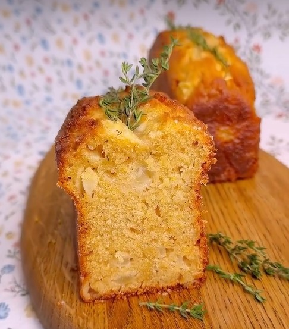

# Кекс с грушами, белым шоколадом и тимьяном

#### Ингредиенты

на две формы 20х5х6 см

* груши 300 г
* сливочное масло 140 г
* сахар 100 г
* ванильная пудра 1 ч л
* 3 яйца
* сметана 120 г
* липовый мед или сироп топинамбура 1 ст л
* цедра 1 лимона
* пшеничная мука 180 г
* ржаная мука 70 г
* разрыхлитель 10 г
* большая щепотка соли
* 1 ч л  листочков свежего тимьяна
* белый шоколад 90 г

#### Процесс

Груши очистить, нарезать мелким кубиком 1–1,5 см. Шоколад порубить на кусочки. Форму смазать сливочным маслом и слегка присыпать мукой. Сливочное масло размягчить. Духовку разогреть до 170°C.

В миске взбить размягченное сливочное масло с сахаром и ванилью до светлой, пышной массы. По одному ввести яйца, каждый раз хорошо перемешивая. Понемногу добавить сметану, мед и лимонную цедру. Частями вмешать просеянные сухие ингредиенты и тимьян. В конце примешать груши и шоколад. Выложить тесто в форму, разровнять.

В центр можно отсадить по всей длинную полоску мягкого сливочного масла, для более аккуратного раскрытия теста в процессе выпекания.

Выпекать около 50-60 минут, до сухой деревянной шпажки или температуры внутри кекса в 96С. Остудить в форме 15 минут, затем переложить на решетку.

При желании поверхность, после остывания, можно покрыть глазурью из сахарной пудры и пары ложек лимончелло (или лимонного сока).

_Автор: Нина Тарасова_
