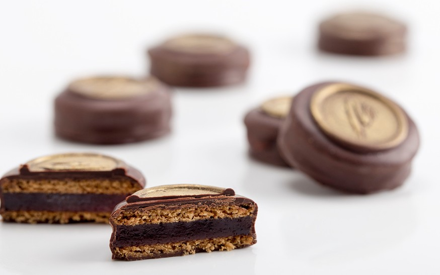

---
image: ../cakes/pics/orange-ginger-cookies.jpg
---
# Имбирное печенье с мармеладом

#### Ингредиенты
на 50 печений

**для смеси А:**
* 75 г меда (ароматный, без яркого вкуса)
* 70 г коричневого сахара (крупными кусочками)
* 75 г сливочного масла (нарезать кубиками)

**для смеси Б:**
* 200 г муки
* 1,7 г соды
* 2,5 г молотой корицы
* 1 г смеси специй для хлеба со специями (кардамон, гвоздика, перец, имбирь, корица)
* 2,5 г сухого молотого или свежего имбиря

* 60 г свежего молока (холодное)

**для мармелада:**
* 225 г пюре красного апельсина
* 0,8 г перца эспелет
* 25 г сахара (1)
* 5 г пектина Slow-set
* 198 г сахара (2)
* 48 г глюкозы (подогреть)
* 4 г раствора лимонной кислоты (2 г воды + 2 г лимонной кислоты)

#### Процесс

Соединить все ингредиенты смеси Б, руками в перчатках растереть все ингредиенты, просеять на лист бумаги для выпечки, переложить в чашу миксера.

Соединить все ингредиенты смеси А, нагреть на медленном огне, мешая силиконовой лопаткой, до полного растворения сахара и закипания. Начать мешать сухую смесь насадкой лопатка, снять смесь А с огня, дать пузырькам успокоиться и сразу вылить в смесь Б, довести до соединения, сильно не вымешивать. В конце добавить холодное молоко, количество может быть больше или меньше в зависимости от муки. Снять со стенок лишнее тесто. Тесто будет очень липким и жидким на вид, очень важно НЕ ДОБАВЛЯТЬ больше муки. Переложить тесто в контейнер, накрыть пленкой в контакт и оставить в холодильнике на 12-24 часа, очень важно выдержать тесто.

Достать тесто за 2 часа до раскатки, чтобы оно стало мягким. Раскатать тесто до толщины 2 мм (для приготовления печенья с мармеладом) или до 4-5 мм (для приготовления расписных пряников), между двух листов пластика или силиконовых ковриков, скалку держать за центр, раскатывать от центра к краю. Тесто можно хранить в раскатанном виде до месяца в морозилке.

Вырезать из теста диски диаметром 4 см и выложить их на решетку между двух перфорированных силиконовых ковриков. Выпекать при 150°С конвекция в течение 8-10 минут. Вынуть, не снимать коврик сразу, полностью остудить, затем снять коврик.

Нагреть пюре с перцем до 40°С. Добавить сахар (1), смешанный с пектином. Довести до кипения, постоянно мешая венчиком. Добавить оставшийся сахар (2), снова довести до кипения и добавить глюкозу. Готовить до достижения 105°С, добавить раствор лимонной кислоты. Распределить по поверхности силиконового коврика ровным слоем толщиной 4 мм с помощью рамки или направляющих соответствующей толщины. Оставить желироваться на 12 часов и затем вырезать диски диаметром 4 см

Вложить по диску мармелада между парами печенья. Оставить на 24 часа при комнатной температуре, давая печенью время напитаться влагой. Искупать печенье в темперированном черном шоколаде с помощью вилки для купания конфет. Декорировать с помощью замороженной печати с логотипом, покрыть отпечаток золотом.