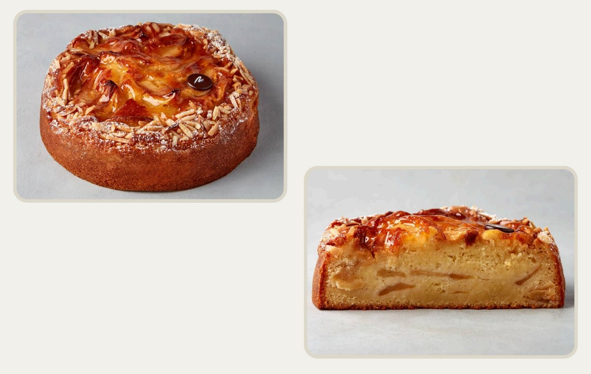

# Шарлотка

#### Ингредиенты

на форму 18 см

**для теста:**  
за 4 часа

* 100 г яиц (комнатной температуры)
* 100 г сахара
* 100 г сливок 33%, крем-фреш или сметаны (комнатной температуры)
* 45 г растительного масла
* 70 г муки
* 40 г миндальной муки
* 6 г разрыхлителя
* 5 г ванильного экстракта
* 0,5 г цедра лимона
* 2 г молотого тимьяна

**для начинки:**

* 400 г яблочных долек
* 30 г сахара
* 20 г сливочного масла
* 40 г пюре маракуйи или лимонного сока
* 1 сухой стручок ванили
* 2 веточки лимонного
тимьяна

#### Процесс

Муку с разрыхлителем и молотым тимьяном, просеять и смешать с миндальной мукой. Яйца комнатной температуры взбить с сахаром, ванильным экстрактом и цедрой на средней скорости в течение 10-15 минут.   
Добавить тонкой струйкой растительное масло, сливки комнатной температуры и просеянные сухие ингредиенты. Повысить скорость и взбивать еще 1 минуту.  
Оставить тесто в холодильнике минимум на 4 часа.  

Яблоки дольками смешать с сахаром, растопленным сливочным маслом, пюре маракуйи или соком лимона, добавить сухой стручок ванили и лимонный тимьян.  
Выложить в 1 слой на противень, застеленный бумагой. Посыпать яблоки равномерно сахаром. Запекать в заранее разогретой духовке при 120-130°C около 30 минут до появления мягкости и лёгкой карамелизации. Яблоки должны остаться с текстурой.  
Полностью остудить и дать стечь на сите.

Выложить в кольцо 1⁄3 теста, выложить 1⁄3 яблок, следующую 1⁄3 теста, снова 1⁄3 яблок, последнюю 1⁄3 теста. На поверхности выложить самые красивые яблочные дольки. Смазать растопленным сливочным маслом, слегка присыпать сахаром и выпекать в кольце при температуре 150-160°C до готовности (45-50 мин). Проверить готовность деревянной палочкой или маленьким ножом. При необходимости закрыть верх фольгой во избежание пригорания в последние 10-15 минут выпечки.

Остудить, украсить сахарной пудрой и покрыть яблоки нейтральной глазурью

_Автор: Мария Селянина_
