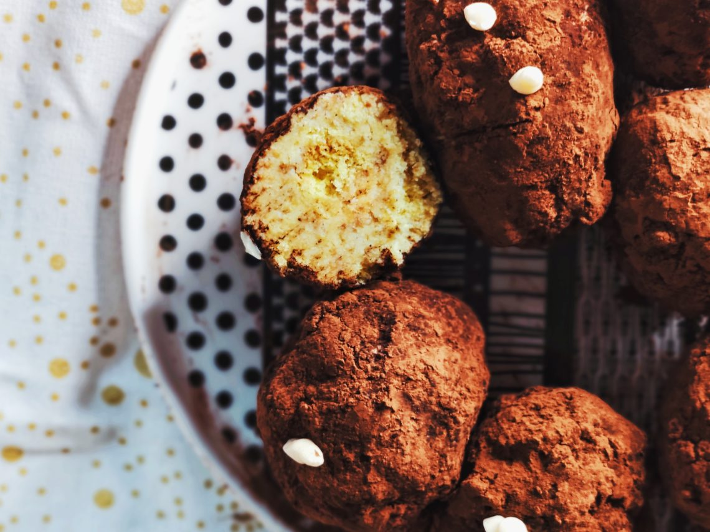

# Пирожное “Картошка”

#### Ингредиенты

* 2 яйца категории с1
* 60 граммов пшеничной муки
* 15 граммов кукурузного крахмала
* 50 граммов коричневого сахара
* 2,5 грамма соли
* 1 грамм разрыхлителя, да, я использую его для перестраховки
* масло и мука для обработки формы

* 115 граммов мягкого сливочного масла
* 60 граммов сгущенного молока
* 50 граммов пудры из коричневого сахара
* 40 граммов раскрошенных ванильных сухарей
* 30 граммов торфяного виски
* 2 грамма соли
* 50 граммов темного какао для обваливания
* _15-20 граммов порошка какао_

#### Процесс

Включить духовку на 180 градусов.

Яйца с сахаром взбить до плотной пышной пены. Если по ней провести венчиками миксера, на поверхности должны на несколько секунд задержаться следы от них. Ручной миксер с этой задачей справляется за 5-6 минут, можно поставить таймер. Таймеры действительно помогают.

Муку смешать с крахмалом, солью и разрыхлителем и нежно при помощи силиконовой лопатки вмешать в яичную пену. Сделать это надо так, чтобы в тесте не осталось “карманов” с мукой и крахмалом, но довольно быстро и минимальным количеством движений, чтобы не лишить бисквит воздуха.

Смазать форму маслом, добавить в нее небольшое количество муки и повращать формой по кругу, чтобы она равномерно укуталась в тонкий слой муки.

Переложить в форму тесто и выпекать 20-30 минут, зависит от слоя теста и диаметра формы соответственно. У меня была слишком большая форма и тонкий слой бисквита, поэтому он испекся за 18 минут. Готовый бисквит пружинит под пальцами, а воткнутая в него зубочистка выходит сухой и может быть с одной сухой крошкой. Или двумя. Но вряд ли тремя.

Готовому бисквиту дать остыть, достать из формы и раскрошить не совсем в труху. Я предпочитаю бисквитные крошки разного размера. А еще не срезаю корочку, потому что она дает больше текстуры.

Если вы хотите сделать насквозь шоколадную картошку, на этапе замешивания добавить в нее 15-20 граммов порошка какао. Возможно придется сделать чуть больше крема в этом случае, какао забирает довольно много воды. Добавить алкоголя.

Мягкое сливочное масло (его можно достать из холодильника, когда вы начинаете делать бисквит) взбить с сахарной пудрой до пышного кремового состояния. Добавить сгущенку, продолжая взбивать. Крем должен быть очень светлый и довольно объемный.

Отложить примерно 30-40 граммов крема, он нужен, чтобы потом на картошке сделать “проростки”.

Смешать в миске бисквитные крошки и раскрошенные ванильные сухари, добавить соль, крем и алкоголь. Смешать до однородного пастообразного состояния. Паста должна быть влажной, но не чересчур.

Скатать картошку. Обвалять картошку в какао-порошке, стряхнуть излишек. Сделать это можно кисточкой или, например, нежно повалять картошку в сите. 

Отложенный крем переложить в кондитерский мешок, срезать кончик и отсадить “проростки” на подходящие картофельные неровности.

Отправить в холодильник на 2-2,5 часа и есть.

_Автор: ИРИНА КОГАН_