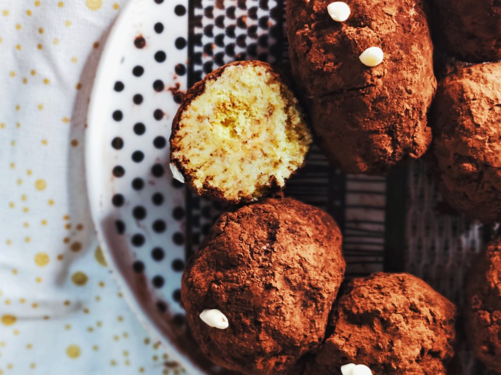

# Пирожное “Картошка”

#### Ингредиенты

* 2 яйца категории с1
* 60 г пшеничной муки
* 15 г кукурузного крахмала
* 50 г коричневого сахара
* 2,5 г соли
* 1 г разрыхлителя

* 115 г мягкого сливочного масла
* 60 г сгущенного молока
* 50 г сахарной пудры
* 40 г миндальной муки или 40 г раскрошенных ванильных сухарей (дадут текстуру)
* 30 г торфяного виски
* 2 г соли
* 50 г темного какао для обваливания
* _15-20 г порошка какао_

#### Процесс

Разогреть духовку до 180 градусов.

Яйца с сахаром взбить до плотной пышной пены (5-6 минут). Если по ней провести венчиками миксера, на поверхности должны на несколько секунд задержаться следы от них. 

Муку смешать с крахмалом, солью и разрыхлителем и нежно при помощи силиконовой лопатки вмешать в яичную пену минимальным количеством движений, чтобы не лишить бисквит воздуха.

Распределить бисквит по противню, выпекать чуть больше 10 минут. Готовый бисквит пружинит под пальцами. Готовому бисквиту дать остыть и раскрошить не совсем в труху. Для шоколадной начинки на этапе замешивания добавить в нее 15-20 г порошка какао.

Мягкое сливочное масло взбить с сахарной пудрой до пышного кремового состояния. Добавить сгущенку, продолжая взбивать. Крем должен быть очень светлый и довольно объемный.

Отложить примерно 30-40 г крема, он нужен, чтобы потом на картошке сделать “проростки”.

Смешать в миске бисквитные крошки и раскрошенные ванильные сухари, добавить соль, крем и алкоголь. Смешать до однородного пастообразного состояния. Паста должна быть влажной, но не чересчур.

Скатать картошку. Обвалять картошку в какао-порошке, стряхнуть излишек. Сделать это можно кисточкой или, например, нежно повалять картошку в сите. 

Отложенный крем переложить в кондитерский мешок, срезать кончик и отсадить “проростки” на подходящие картофельные неровности.

Отправить в холодильник на 2-2,5 часа и есть.

_Автор: ИРИНА КОГАН_
