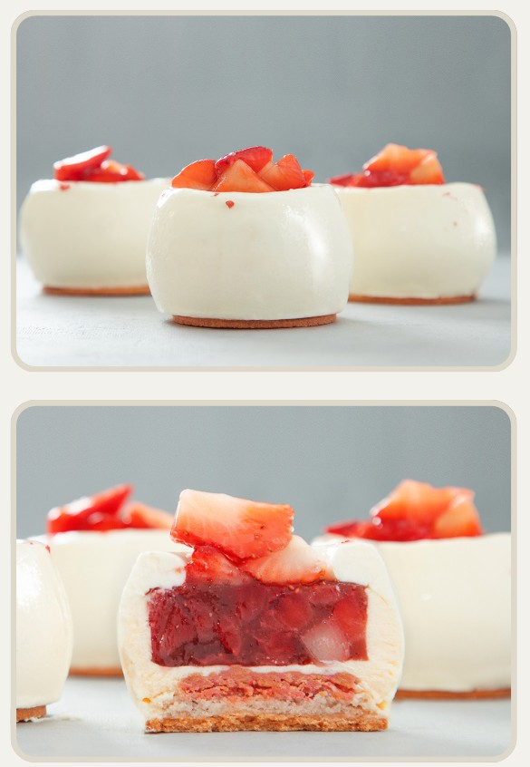

# Пирожное Клубника-Сметана

#### Ингредиенты:
на 16 пирожных диаметр 65 мм, высота 30 мм, объем 85 мл
на 40 ml x 15 Truffles 40 - половина объема

**для бисквита дакуаз:** 
* белки 150 г
* альбумин 2-3 г
* сахар 75 г
* миндальная мука 75 г
* сахарная пудра 150 г
* мука 30 г

**для хрустящего слоя:**
* белый шоколад 60 г
* растительное масло без запаха 30 г
* порошок сублимированной клубники 10 г
* молотый розовый перец 1 г

**для клубничного желе:**
* свежая клубника, нарезанная кубиками 375 г
* пюре клубники 150 г
* сахар 30 г
* декстроза 30 г
* бальзамический уксус 15 г
* соль 1,5 г
* пектин NH 7,5 г
* желатин 200 Bloom 7 г (49 г желатиновой массы)

**для сливочного мусса:** - за 24 ч.
* сливки 33–35% 220 г
* розовый перец 3 г
* сметана 30% 250 г
* желтки 80 г
* сахар 50 г
* инулин 10 г
* соль 1 г
* желатин 200 Bloom 5 г (30 г желатиновой массы)

**для панна-котты:** - 8ч
* сливки 35% 435 г
* сахар 30 г
* желатин 200 Bloom 5 г (35 г желатиновой массы)

**для клубники в вакууме:**
* клубника 300 г
* сахар 25 г
* настой жасминового чая 50 г
* бальзамический уксус 10 г
* соль 1 г

#### Приготовление

Приготовить [Бисквит Дакуаз](https://mars9n9.github.io/cakes/%D0%91%D0%B0%D0%B7%D0%BE%D0%B2%D1%8B%D0%B9/%D0%91%D0%B8%D1%81%D0%BA%D0%B2%D0%B8%D1%82%D1%8B/dacquoise.html) Выложить размером 20х30 см, высотой 1,2-1,5 см. Посыпать дважды сахарной пудрой. Выпекать при 180С 12-14 минут. Вырезать бисквиты нужного размера и формы из выпеченного подмороженного бисквита.

Приготовить хрустящий слой. Растопить шоколад, добавить в него растительное масло, и все сухие ингредиенты, перемешать. Распределить на вырезанные размороженные бисквиты тонким слоем. Заморозить.

**Сливки настоять с розовым перцем 24 ч.** Сметану, сахар, инулин, соль смешать и на медленном огне довести до кипения (до 85 градусов). Смешать смесь с желтками, перемешать и довести до 82 градусов.
Добавить растопленную желатиновую массу. Пробить смесь блендером и быстро остудить до 35-38 градусов.
Смешать с полувзбитыми сливками температуры 8-10 градусов. Собрать пирожные. Заморозить.

⅓ сливок с нагреть с сахаром помешивая венчиком до 65°С (до растворения сахара), растворить желатин в горячих сливках, тщательно перемешать. Добавить холодные сливки. Процедить, перелить в кувшин. Дать желироваться в холодильнике минимум 8 часов. Взбить в миксере до гладкой пластичной текстуры.  Декорировать пирожные

Приготовить клубнику. Нарезать клубнику на кусочки нужного размера. Смешать все ингредиенты, кроме клубники. Залить клубнику полученной смесью. 10 минут в вакууме (или 15-20 минут в контейнере или зип пакете), дать стечь.

Приклеить центры из клубничного желе на дно формы.
2. Сверху залить и разровнять мусс, хорошо заполнив пространство вокруг желе.
3. Сверху уложить бисквиты хрустящим слоем вниз.Заморозить.
4. Взбить панна котту и декорировать пирожные. Заморозить.
5. Покрыть пирожные нейтральной глазурью. Установить на основу из сабле (опц).
Разморозить пирожные.
6. Клубнику в вакууме смешать с нейтральной глазурью, декорировать пирожные.
7. Декорировать пирожные розовым перцем.