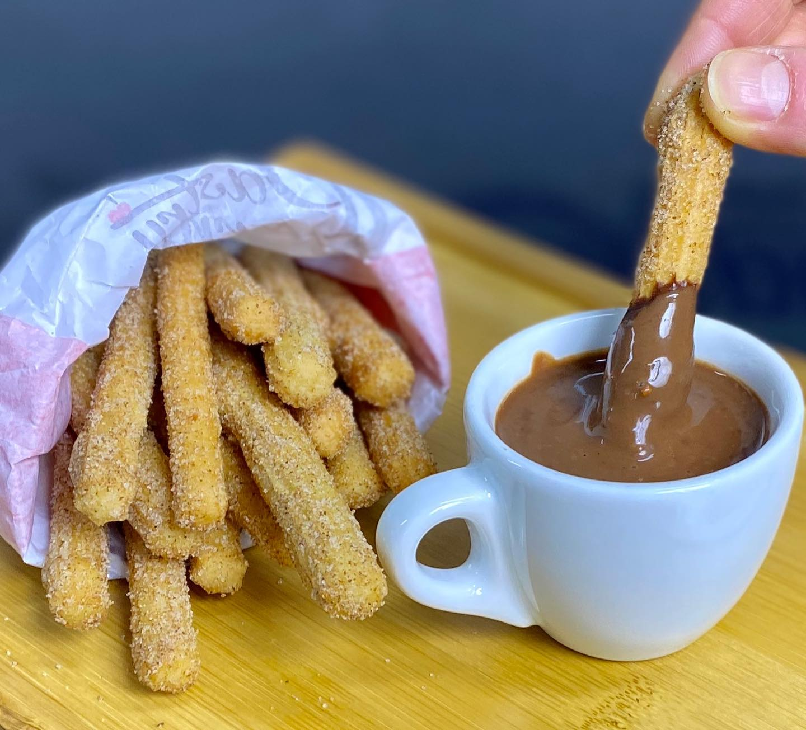

# Шоколад для чуррос

#### Ингредиенты:

* темный шоколад 75-80% 300 г
* какао-порошок 50 г
* сахар мусковадо 75 г
* сахарная пудра 25 г
* кукурузный крахмал 25 г
* соль 3 г
* ванильная икра 2 г

**для ацтекского шоколада:**
* боб тонка ½
* молотая корица 5 г
* мускатный орех 2 г
* гвоздика 0,5 г
* перец эспеллет 5 г

#### Приготовление

Смешать сахар с крахмалом и специями, смолоть в кофемолке до максимально тонкого состояния. Шоколад в каллетах или мелко нарубленные кусочки плитки заморозить. Смешать замороженный шоколад со смесью сухих ингредиентов, пробить в фудпроцессоре с ножами для получения максимально мелкой крошки. Хранить в закрытом контейнере при комнатной температуре.

Для приготовления 1 большой чашки шоколада на плите смешать в ковшике 150 г молока или воды со 100 г смеси для горячего шоколада. Довести до кипения, постоянно мешая.
