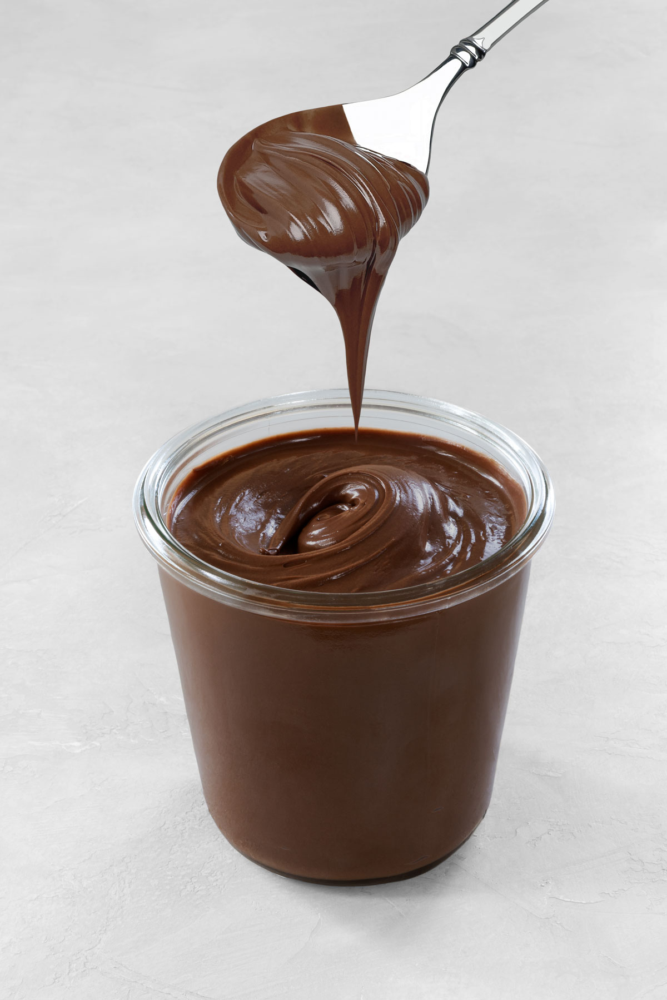

# Нутелла

#### Ингредиенты:

* молочный шоколад 125 г
* горький шоколад 64% 125 г
* паста из фундука 250 г
* растительное масло 50 г
* какао 25 г

#### Приготовление

Растопить шоколад на водяной бане или в микроволновой печи. Добавить ореховую пасту, перемешать.Затем растительное масло без запаха и какао порошок. Хорошо перемешать. Убрать на 20-30 минут в холодильник.

*Adriano Zumbo*
