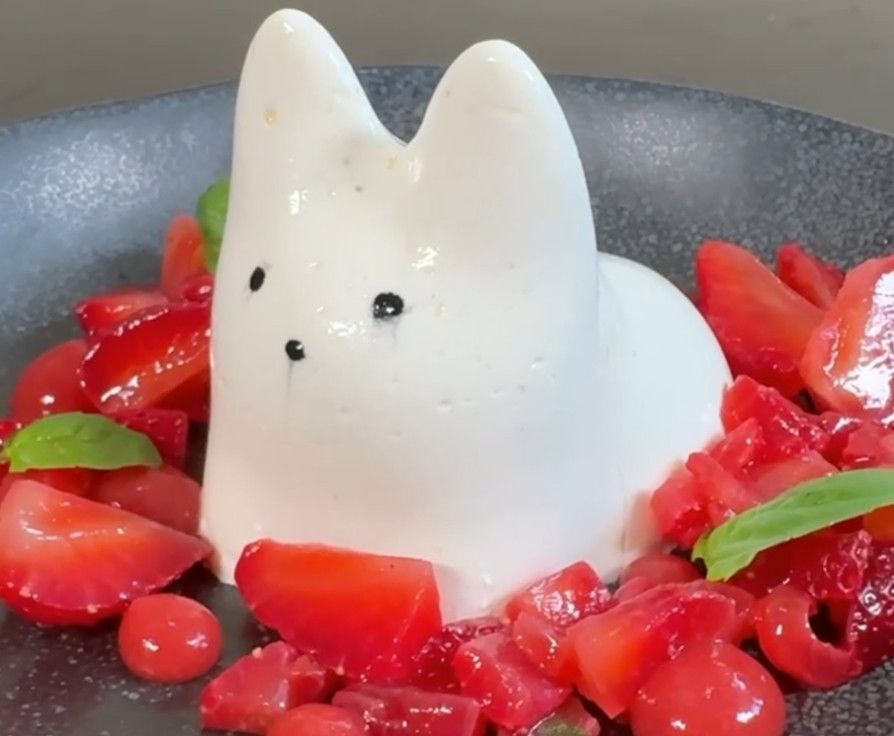

# Панна-котта лайм базилик с клубникой

#### Ингредиенты:
на 3 порции по 170 г или одну 510 г

**для панна-котты:** - за 24ч + 8ч
* сливки 35% 520 г
* листья зеленого базилика 20 г
* 2 лайма (цедра)
* сахар 35 г
* желатин 200 Bloom 7 г (49 г желатиновой массы)

**для жасминового настоя:**
* вода 100 г
* зеленый чай с жасмином 10 г
* сахар 25 г

**для клубничного геля для декора:** - за 24ч
* пюре клубники комнатной температуры 125 г
* настой жасминового чая 25 г
* яблочный уксус 3 г
* сироп глюкозы 3 г
* агар 1,5 г
* сахар 10 г

**для клубники в вакууме:**
* клубника 300 г
* сахар 25 г
* настой жасминового чая 50 г
* бальзамический уксус 10 г
* соль 1 г

#### Приготовление

Настоять холодным способом все сливки с цедрой и бализиком, в закрытом контейнере в течение 24 часов. 

Приготовить жасминовый настой. Нагреть воду с сахаром до 85С, добавить чай, настоять 10-15 минут, процедить.

Приготовить гель. Смешать пюре комнатной температуры с сиропом глюкозы и настоем чая (добавляет воду, можно заменить на воду), добавить уксус. Добавить агар, смешанный с сахаром в форме дождика. Довести до уверенного кипения на низком огне, проварить 30 сек - 1 мин, чтобы агар среагировал. Вылить в контейнер, закрыть пленкой в контакт, дать застыть. Стабилизировать в холодильнике 12-24 часа.

**Можно использовать в виде кусочков для декора.** Пробить в комбайне с ножами до гладкой блестящей текстуры, процедить и охладить. Переложить в бутылочку или бумажный корнет для использования. Гель может храниться в холодильнике до 7 дней.

Процедить 2/3 сливок. ⅓ сливок с листьями и цедрой нагреть с сахаром помешивая венчиком до 65°С (до растворения сахара), растворить желатин в горячих сливках, тщательно перемешать. Добавить холодные настоянные сливки. Процедить, перелить в кувшин.

Смазать силиконовый молд маслом тонким слоем, залить сливки в молд, следить, чтобы не было пузырьков.Дать стабилизироваться минимум 8 часов в холодильнике.

Приготовить клубнику. Нарезать клубнику на кусочки нужного размера. Смешать все ингредиенты, кроме клубники. Залить клубнику полученной смесью. 10 минут в вакууме (или 15-20 минут в контейнере или зип пакете), дать стечь.

Вынуть на тарелку, выложить вокруг клубничный салат и капельки геля для сочности