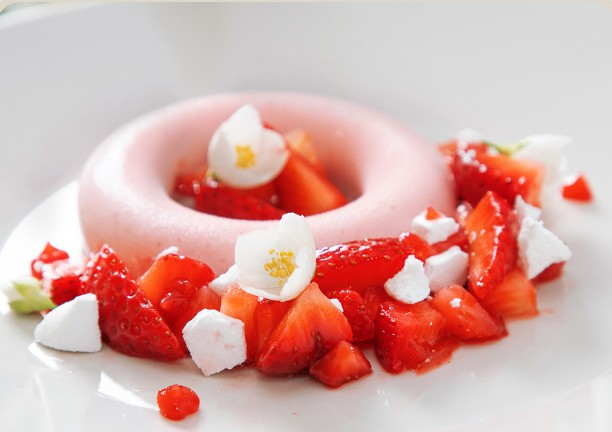

# СЕМИФРЕДДО
КЛУБНИКА-ЖАСМИН

#### Ингредиенты:
на 6 форм для семифреддо в форме кольца внешним диаметром 8-9 см и квадратную форму 14Х14 см

**для семифреддо:** - за 24 + 24ч
* сливки 35% 240 г
* зеленый чай с жасмином 10 г
* пюре клубники 170 г
* сок лайма 20 г
* декстроза 15 г
* инулин 20 г
* белки пастеризованные 60 г
* сахар 100 г
* вода 30 г
* соль 1 г
* порошок сублимированной клубники 10 г
* *кусочки сублимированной клубники*

**для жасминового настоя:**
* вода 100 г
* зеленый чай с жасмином 10 г
* сахар 25 г

**для геля:** - за 24ч
* пюре клубники комнатной температуры 250 г
* настой жасминового чая 50 г
* яблочный уксус 5 г
* сироп глюкозы 5 г
* агар 2,5 г
* сахар 20 г

**для клубники в вакууме:**
* клубника 200 г
* сахар 15 г
* настой жасминового чая 15 г
* яблочный уксус 3 г
* соль 1 г

**для меренги:** - 3-12 ч
* настой жасмина 100 г
* альбумин 15 г
* сахар 100 г
* сахарная пудра 100 г

#### Приготовление

Приготовить семифреддо. **Сливки настоять с чаем 24 часа.**  Процедить, восстановить изначальное количество, взбить как для мусса. Растопленное клубничное пюре смешать с соком лайма, декстрозой и инулином, порошком клубники и солью. Медленно довести до 85ºC, помешивая венчиком. При необходимости пробить блендером.
Сделать итальянскую меренгу (121С). Взбивать до остывания до 40-45 С, осторожно влить клубничную смесь (температуры 40-45 С), смешать с полувзбитыми сливками.
Распределить по формам, **заморозить в течение 24 часов**.

Приготовить жасминовый настой. Нагреть воду с сахаром до 85С, добавить чай, настоять 10-15 минут, процедить.

Приготовить гель. Смешать пюре комнатной температуры с сиропом глюкозы и настоем чая (добавляет воду, можно заменить на воду), добавить уксус. Добавить агар, смешанный с сахаром в форме дождика. Довести до уверенного кипения на низком огне, проварить 30 сек - 1 мин, чтобы агар среагировал. Вылить в контейнер, закрыть пленкой в контакт, дать застыть. Стабилизировать в холодильнике 12-24 часа.

**Можно использовать в виде кусочков для декора.** Пробить в комбайне с ножами до гладкой блестящей текстуры, процедить и охладить. Переложить в бутылочку или бумажный корнет для использования. Гель может храниться в холодильнике до 7 дней.

Приготовить клубнику. Нарезать клубнику на кусочки нужного размера. Смешать все ингредиенты, кроме клубники. Залить клубнику полученной смесью. 10 минут в вакууме (или 15-20 минут в контейнере или зип пакете), дать стечь.

Приготовить меренгу. Настой жасмина пробить с альбумином и оставить минимум на 30 минут (можно до 12
часов в холодильнике). Сделать французскую меренгу, добавляя частями сахар и пудру. Для маленького количества взбивать ручным миксером. Переложить в мешок, выложить.
Высушить в дегидраторе при 50-60 градусах в течение 24 часов.
Альтернативно - высушить в духовке при 60-90 градусах 1.5- 3 часа, в зависимости от вида изделий и их количества.

На десертную тарелку поставить металлическое кольцо диаметром, который соответствует внешнему диаметру форм для семифреддо (8-9 см). Выложить кусочки вакуумированной клубники с внешней стороны кольца. Выложить кусочки высушенной французской меренги на клубнику. Выложить капельки клубничного геля. Убрать металлическое кольцо и выложить семифреддо. Выложить немного клубники и меренги внутрь кольца семифреддо. Завершить декор цветком жасмина.