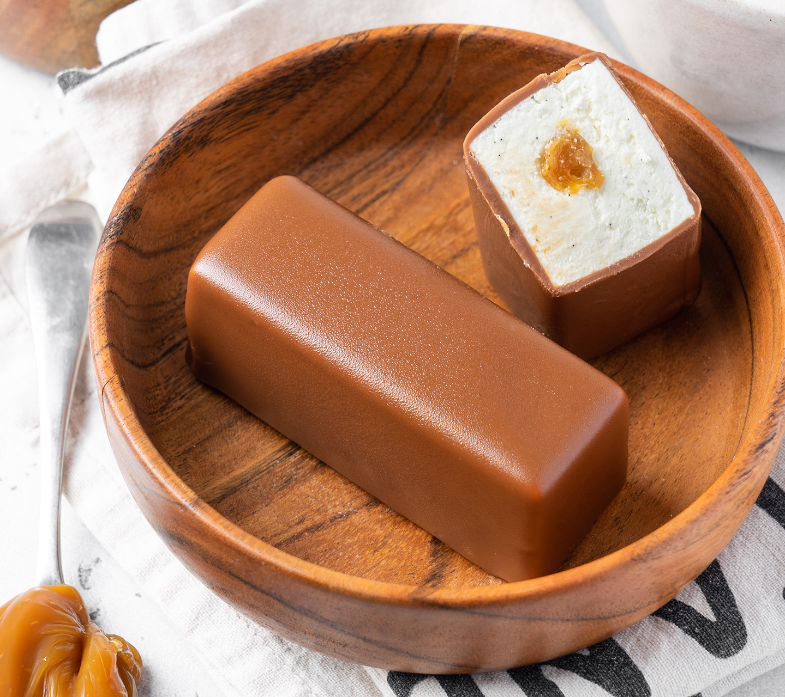

# Творожные сырки 

#### Ингредиенты:

* сливки 33% 130 г
* ваниль бурбон 1 шт или ванильный экстракт 8 г
* творог 8% 400 г
* сливочное масло 82,5% 100 г
* шоколад белый 100 г
* dulce de leche 100 г

**для глазури:**
* шоколад молочный 30% 250 г
* dulce de leche 25 г
* масло растительное 50 г

#### Приготовление

В сотейнике довести до кипения жирные сливки и семена ванили и стручок, разрезанный пополам. Настоять, накрыв пищевой пленкой.

Протереть творог через сито.

Вынуть стручок из сливок, прогреть. Белый шоколад залить горячими сливками, пробить блендером. Сливки с шоколадом не должны быть горячее 40 градусов. Аккуратно вылить массу в творожную смесь, смешивая всё миксером. Выложить в большой мешок.

В маленький мешок переложить начинку.

Наполовину наполнить все ячейки силиконовой формы, провести в центре бороздку для начинки, отсадить начинку диаметром 4-5 мм. Постучать формой по столу, чтобы творожная масса хорошо распределилась. Снова отсадить творожную массу сверху, постучать формой и разгладить спатулой.

Заморозить в морозильной камере на сутки. Хранить можно 3-4 недели.

Приготовить глазурь сразу перед глазировкой. Шоколад растопить, добавить остальные ингредиенты, пробить блендером.

Вынимать из формы замороженные сырки по одному. Прокалывать шпажкой и макать в стакан. Сырок держать вверх, стуча шпажкой о горлышко стакана, излишки глазури будут стекать вниз. Затем аккуратно выставить сырок на силиконовый коврик.

Убрать сырки в холодильник на 2-3 часа, они оттают и шпажки можно будет вынуть.

*andychef.ru*