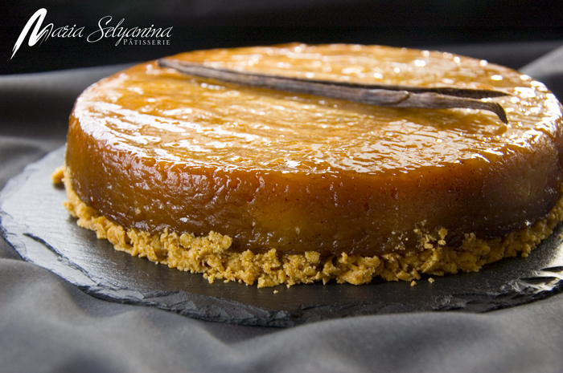

---
image: ../cakes/pics/tatin.jpg
---
# Tarte Tatin

#### Ингредиенты

на форму 20 см

**для начинки:**

* 150 г сахара
* 20 г сливочного масла
* 6-7 крупных яблок
* стручок ванили или корица или цедра лимона

**для основы:**

* 50 г коричневого сахара
* 50 г муки
* 50 г молотого миндаля
* 50 г холодного сливочного масла
  
или 150 г песочного или слоеного теста

#### Процесс

Сделать сухую карамель с ванилью. Для этого в кастрюлю с толстым дном или сковороду на большом огне положить семена ванили и стручок (ваниль можно заменить корицей, лим. цедрой), и растопить сначала небольшое количество сахара, постепенно подсыпая остаток по чуть-чуть. Кастрюлю нужно периодически снимать с огня, и, взяв за ручку, вращать кистью руки так, чтобы сахар распределялся и плавился равномерно. Не размешивать сахар! Когда весь сахар растопится, добавить сливочное масло и как следует перемешать, чтобы смесь стала однородной. Вылить в подготовленную силиконовую форму.

Почистить яблоки, вырезать сердцевину, разрезать пополам. Выложить в силиконовую форму стоя, в профиль, одно за другим по кругу. Центр тоже заполнить яблоками, так, чтобы они горкой возвышались над формой. Они в процессе выпечки осядут.

Поставить в разогретую до 170С духовку на 40-50 минут. После этого времени форму вынуть, и если яблоки стали мягкими ПРИДАВИТЬ ИХ крышкой или тарелкой такого же (или чуть меньшего) диаметра, как форма. После чего вернуть в духовку и печь, пока яблоки не станут совсем мягкими, а жидкость почти выпарится (еще 30-40 минут).

Вынуть, снова тщательно придавить крышкой, остудить, снова придавить и сразу заморозить в форме.

Приготовить крамбл. Все ингредиенты смешать в миксере или вручную до однородного состояния. Скатать в колбаску, завернуть в пищевую пленку, заморозить. Замороженный крамбл натереть на крупной терке или пропустить через мясорубку, выложить в кольцо 20 см, разровнять, но не прижимать, чтобы не нарушить текстуру, печь до готовности (золотистого цвета) при температуре 150-160С - 15-20 мин.

Выложить на теплый крамбл, дать разморозиться.

_Автор: Мария Селянина_
