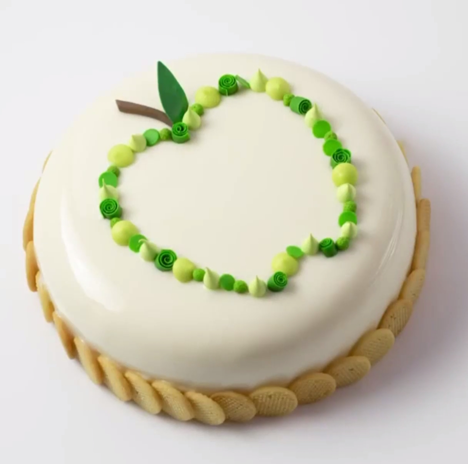
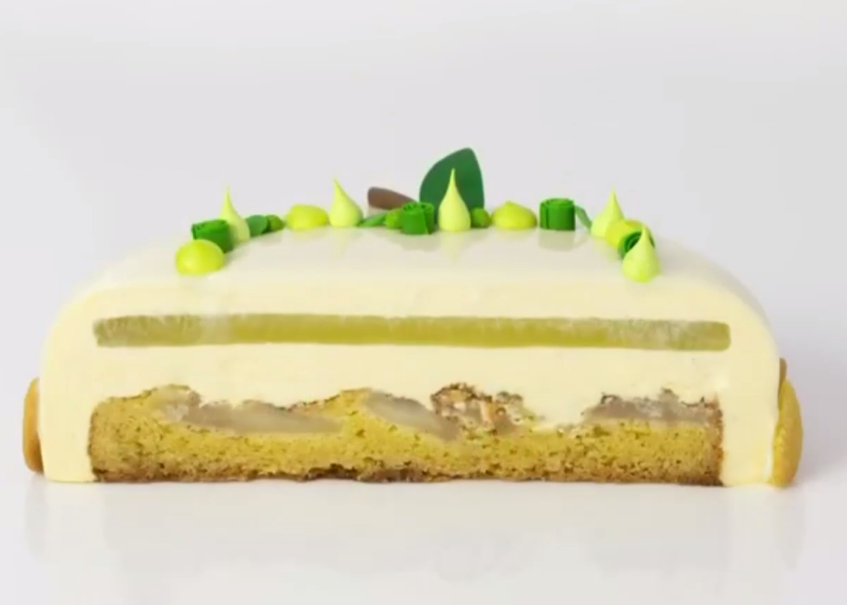
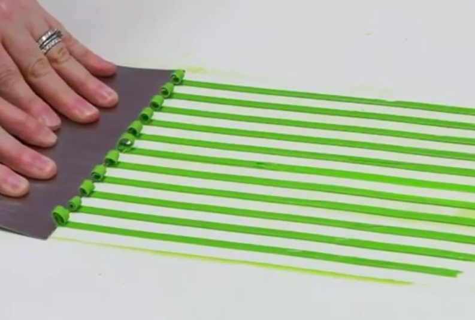

---
image: ../cakes/pics/apple-mousse-kirstentibballs-1.jpg
---
# Муссовая яблочная шарлотка рецепт Kirsten Tibballs

Состав: ванильный мусс с маскарпоне, центр из яблочной шарлотки, яблочное желе

#### Ингредиенты

на 1 торт в форме Silikomart Universo (1200 мл, 18 см)

**Яблоки с корицей**

* 250 г - яблоки Гренни Смиn
* 15 г - мало сливочное
* 1,5 г - молотая корица
* 45 г - мелкокристаллический сахар

**Вставка-шарлотка**

* 93 г - масло сливочное, размягчённое
* 93 г - мелкокристаллический сахар
* 40 г - желтки
* 128 г - мука
* 12 г - разрыхлитель
* 2 г - соль
* Mycryo для посыпки

**Яблочное желе**

* 5 г. - листовой желатин, золотой
* 180 г. - яблочное пюре
* 30 г. - сахар

**Мусс Ваниль-Маскарпоне**

* 7 г. - листовой желатин, золотой
* 40 г. - сахар
* 12 г. - вода
* 60 г. - молоко 3,5%
* 128 г. - белый шоколад 28%
* 40 г. - желтки
* семена 2 стручков ванили
* 4 г. - ванильная паста
* 268 г. - сливки 35%
* 192 г. - маскарпоне

**Белая зеркальная глазурь**

* 8 г. - листовой желатин, золотой
* 40 г. - молоко 3,5%
* 40 г. - сливки 35%
* 60 г. - вода
* 135 г. - сироп глюкозы
* 268 г. - нейтральная глазурь
* 273 г. - белый шоколад 33%

#### Процесс

*Песочное тесто для вставки и декора* В деже планетарного миксера с насадкой лопатка смешать до однородности сахар и масло. Не переставая взбивать медленно добавить желтки, смешать до их полного включения. Остановить миксер и за раз всыпать просеянные вместе муку, разрыхлитель и соль. Замешать на низкой скорости до момента, когда тесто начнёт скатываться в шар. Достать, сформировать небольшой квадрат, обернуть в пищевую плёнку и убрать в холодильник на час.

*Яблоки с корицей.* Яблоки очистить, удалить сердцевину, нарезать на 8 клиньев. Масло растопить. блоки выложить в миску, тщательно перемешать с растопленным маслом, корицей и сахаром.

*Вставка-шарлотка* Раскатать тесто на припыленном мукой силиконовом коврике до толщины в 1см. Вырезать диск 16см. Выложить в слегка смазанное растительным маслом кольцо 16см. Остальное тесто оставить на декор. В кольцо поверх теста веером выложить яблоки с корицей. Выпекать при 170С 15-20 минут до золотистого цвета. Достать и сразу же посыпать какао-маслом Mycryo.

*Диски печенья на декор.* Оставшееся от шарлотки тесто раскатать меж двух силиконовых ковриков до толщины 2мм., при помощи кулинарного кольца 2см. вырезать диски (на торт нужно 30 шт.). Распределить диски теста на решетке с перфорированным силиконовым ковриком, выпекать при 170С 2-5 минут до золотисто-коричневого цвета. Достать и сразу же посыпать поверхность печенья какао-маслом Mycryo. Дать остыть. Хранить в герметичном контейнере.

*Яблочное желе.* Желатин замочить в ледяной воде. В сотейнике пюре с сахаром довести до кипения и полного растворения сахара. Снять с огня, вмешать отжатый желатин. Распределить пюре по силиконовой форме диску 16см. Заморозить.

*Мусс Ваниль-Маскарпоне.* Желатин замочить в ледяной воде. В сотейнике вскипятить воду с сахаром до полного растворения сахара. Параллельно довести до кипения молоко. Вылить горячее молоко поверх шоколада и пробить погружным блендером, чтобы сделать ганаш. Вмешать отжатый желатин и дать остыть до 40С.  
Семена ванили, ванильную пасту, желтки и сахарный сироп смешать вместе и поставить на водяную баню. Постоянно взбивая венчиком, довести до 70С.  
Маскарпоне размягчить. Сливки взбить до лёгких пик и аккуратно вмешать в размягчённый маскарпоне.  
Желтковую смесь смешать с ганашем, затем при помощи силиконовой лопатки вмешать смесь с маскарпоне.

*Белая зеркальная глазурь.* Желатин замочить в ледяной воде. В сотейнике молоко, сливки, воду и глюкозу довести до кипения, вылить поверх нейтральной глазури и смешать до однородности. Вмешать отжатый желатин и вылить смесь поверх шоколада, пробить погружным блендером до гладкости. Накрыть пищевой плёнкой в контакт"вконтакт", отставить в холодильнике на ночь.

*Сборка.* (лицом вниз) В силиконовую форму отсадить мусс, заполняя форму наполовину, распределить мусс шпателем по краям формы. Дать немного замерзнуть.
В центр выложить замороженный диск желе, закрыть тонким слоем мусса и выложить вставку-шарлотка яблоками вниз. Утопить, распределяя мусс по бокам. Удалить излишки мусса шпателем, заморозить.  
Глазурь прогреть в микроволновке до 30С, пробить блендером. Замороженный торт глазировать. По низу приклеить внахлест диски испечённого печенья. Декорировать шоколадным декором

