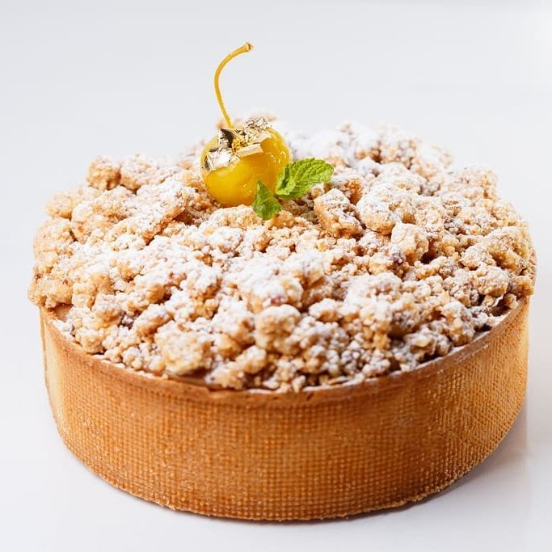
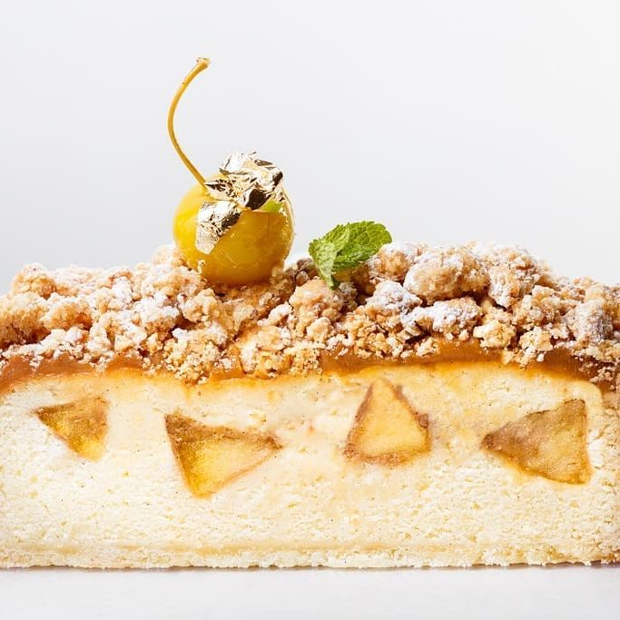
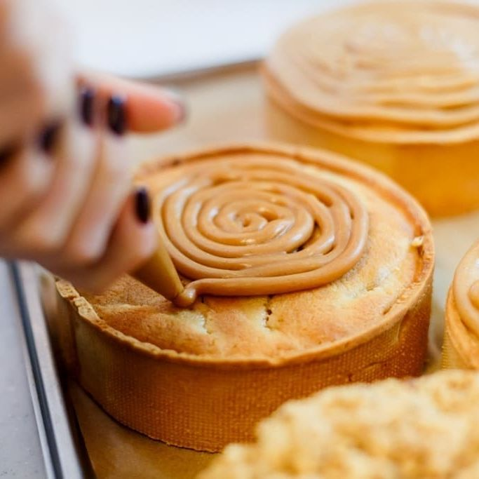

---
image: ../../pics/cake-apple-caramel-ovando.jpg
---
# Торт с карамельными яблоками рецепт Hans Ovando

#### Ингредиенты

**Томленое яблоко**

* 550 г - яблоки Голден
* 330 г - сливки
* 220 г - сахар
* 1 стручок ванили

**Ванильное сабле**

* 115 г - мука (1)
* 160 г - сахарная пудра
* 4 г - соль
* 55 г - миндальная мука
* 255 г - нарезанное кубиками сливочное масло
* 76 г - яйцо
* 330 г - мука (2)
* 1/2 стручка ванили

**Сироп**

* 500 г - вода
* 150 г - сахар
* 80 г - ром 7 лет
* 4 пустых стручка ванили
* 2 г - экстракт ванили

**Фундучный штрейзель**

* 30 г - миндальная мука
* 60 г - фундучная мука
* 50 г - сахар коричневый
* 50 г - сахар
* 100 г - холодное сливочное масло, нарезанное кубиками
* 100 г - сильная мука
* 100 г - цельный фундук

**Соленая карамель**

* 190 г - сахар
* 10 г - глюкоза
* 200 г - сливки 35%
* 145 г - сливочное масло
* 1 стручок ванили
* 2 г - флер де сель
* 4 г - желатин 220 Блум

#### Процесс

*Томленое яблоко* Яблоки очистить от кожуры и разрезать на дольки. Вскипятить сливки с ванилью и отставить на низком огне, чтобы они не остыли. В кастрюле приготовить карамель с сахаром и постепенно добавить горячие сливки, образуя ириску. Яблоко потушить в ириске «аль денте».

*Ванильное сабле* Смешать муку (1), сахарную пудру, соль, ваниль и миндальную пудру и перемешать с маслом в миксере насадкой лопатка до песочного состояния. Постепенно добавить яйцо и муку (2). Раскатать между гитарными листами до 3 мм и поставить в холодильник на час. Вырезать форму тарта и выпекать при температуре 150°C 6 минут.

*Ванильный бисквит* Смешать сахар, масло и ваниль с помощью насадки-лопатки на средней скорости. Понемногу добавить яйцо. Просеять вместе муку, соль и разрыхлитель и добавить к масляной смеси. Добавить сливки и оставить в кондитерском мешке.

*Сироп* Смешать все ингредиенты кроме рома и вскипятить. Добавить ром, как только сироп остынет.

*Фундучный штрейзель* Поместить все ингредиенты в блендер, пробить на средней скорости до получения песочной текстуры. Добавить фундук и пробить снова. Оставить в холодильнике на 1 час. Выпечь при температуре 150°С 12 минут.

*Соленая карамель* Желатин замочить в ледяной воде. Сливки довести до кипения вместе с глюкозой и ванилью. Оставить сливки на низком огне, чтобы они не остыли. Растопить сахар, подсыпая понемногу, не помешивая спатулой. Когда он будет готов, добавить в сливки желатин, растворить. Понемногу ввести горячие сливки в карамельный сахар, образуя ириску. Остудить до 40°С, добавить сливочное масло, пробить блендером, добавить соль.

*Сборка.*  Выпеченный тарт наполнить на 1/3 бисквитным тестом, выложит яблоки и заполнить бисквитным тестом доверху. Выпекать 30 минут при 165 градусах. Вынуть и духовки и сразу пропитать холодным сиропом. Остудить, выложить карамель по спирали из кондитерского мешка. Посыпать штрейзелем, затем сахарной пудрой, украсить яблоком.

