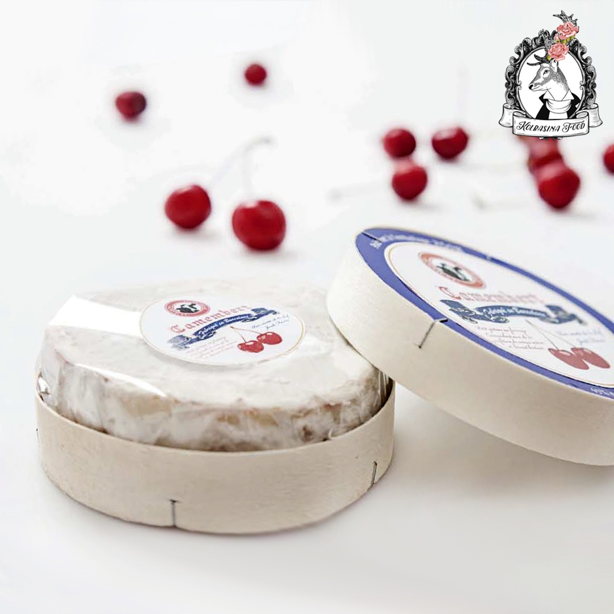
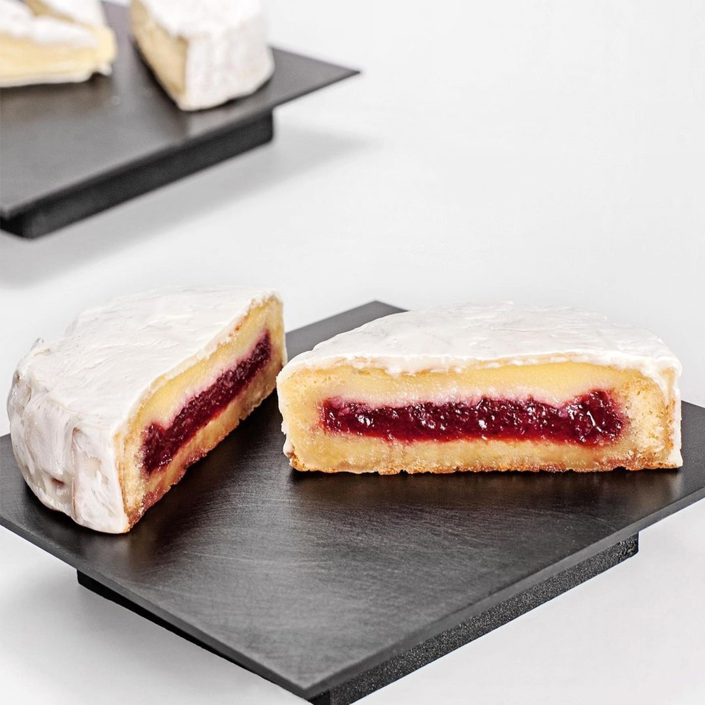

# Чизкейк “Камамбер”

Камамбер - Вишнёвый джем – Сабле Бретон  

#### Ингредиенты

**вишневый джем**

* Вишня без косточек – 900г.
* Пюре абрикоса с кусочками – 100г. (или консервированные абрикосы)
* Сок лимона – 50г.
* Сахар – 500г.
* Сироп глюкозы – 150г.
* Сахар для пектина – 50г.
* Пектин NH – 10г.
* Лимонная кислота – 3г.
* Лиофилизированная вишня – 300г. (сушёная)

**бретонское сабле**

* Сливочное масло, размягчённое – 350г.
* Коричневый сахар – 100г.
* Сахар – 100г.
* Разрыхлитель – 30г.
* Соль - 6г.
* Желтки – 160г.
* Мука с низким содержанием белка – 450г.
* Семена 1 стручка ванили

**чизкейк из Камамбера**

* Яйца – 180г.
* Камамбер – 400г.
* Сыр с голубой плесенью – 30г.
* Йогурт греческий – 375г.
* Топлёное масло – 50г.
* Сахар – 150г.
* Кукурузный крахмал – 50г.

#### Процесс

*Вишневый джем* Смешиваем вишню без косточек с соком лимона, чтобы предотвратить окисление. Часть вишни нарезаем на маленькие кусочки и оставляем в сторону. Остальное смешиваем с кусочками абрикоса в пюре и пробиваем в блендере. Выливаем это всё в сотейник, добавляем кусочки вишни и сахар, доводим до кипения. Добавляем глюкозу и, когда она растопилась, добавляем смесь сахара с пектином. Увариваем до 105С и 65 Brix. Снимаем с огня, добавляем лиофилизированную вишню и лимонную кислоту.

*Бретонское сабле* Соединяем все ингредиенты в планетарном миксере с насадкой лопатка и на высокой скорости вымешиваем до получения теста, из которого можно будет сформировать что-либо.
Выкладываем тесто толщиной 1 см в металлические кольца диаметром 12 см с пергаментом на дне. Выпекаем тесто при 180С около 10 минут. Достаем из духовки и с помощью круглой формы поменьше надавливаем на центр теста, тем самым делая углубление для джема. Отправляем в духовку ещё на 5 минут.

*Вставка* Достаем бретонское сабле из формы, наполняет джемом и возвращаем обратно в туже форму, дно и борта которой заранее проложили пергаментом. Важно, чтобы бумага плотно прилегала к бортам формы, создавая таким образом “морщинки”, что в будущем при выпекании чизкейка придаст эффект сыра Камамбер.

*Чизкейк из Камамбера* Соединяем все ингредиенты и пробиваем в блендере до получения однородной консистенции. Переливаем в емкость и оставляем в холодильнике на 12 часов. Голубой сыр добавлять не обязательно, он просто придает более глубокий вкус чизкейку, что отличает его от других более классических вариаций.

После достаем смесь из холодильника и выливаем в форму поверх готового бретонского теста и вишневого джема, оставляя 2 см до краёв. Отправляем в духовку на 20 минут при температуре 180 градусов.
Лучше всего доставать из формы, пока чизкейк ещё горячий. Отделяем бумагу от чизкейка очень аккуратно, чтобы не разрушить все неровности на поверхности чизкейка.

*Сборка*. Смешиваем белый шоколад Velvet от Callebaut и их миндальную пасту в соотношении 80%20%. Когда чизкейк полностью остынет, окунаем его в эту смесь. Шпателем убираем излишки и оставляем кристаллизоваться.  
Часть белого шоколада окрашиваем в белый цвет с помощью диоксида титана. Жёсткой кистью наносим мазками на поверхность чизкейка смесь, не окрашивая его весь.  
Пока шоколад не кристаллизовался, берем кусок мятого пергамента и накрываем чизкейк, тем самым имитируя складки сыра Камамбер.  
Когда шоколад кристаллизовался, убираем пергамент и посыпаем немного сахарной пудрой, излишки убираем кисточкой. Таким образом мы добиваемся имитации известной внешности и формы сыра Камамбер.  
Для презентации чизкейка, можно использовать круглую коробку, имитируя оригинальную упаковку данного сыра с нашим логотипом и описанием чизкейка.

_Автор: Jordi Farrés Miralles_