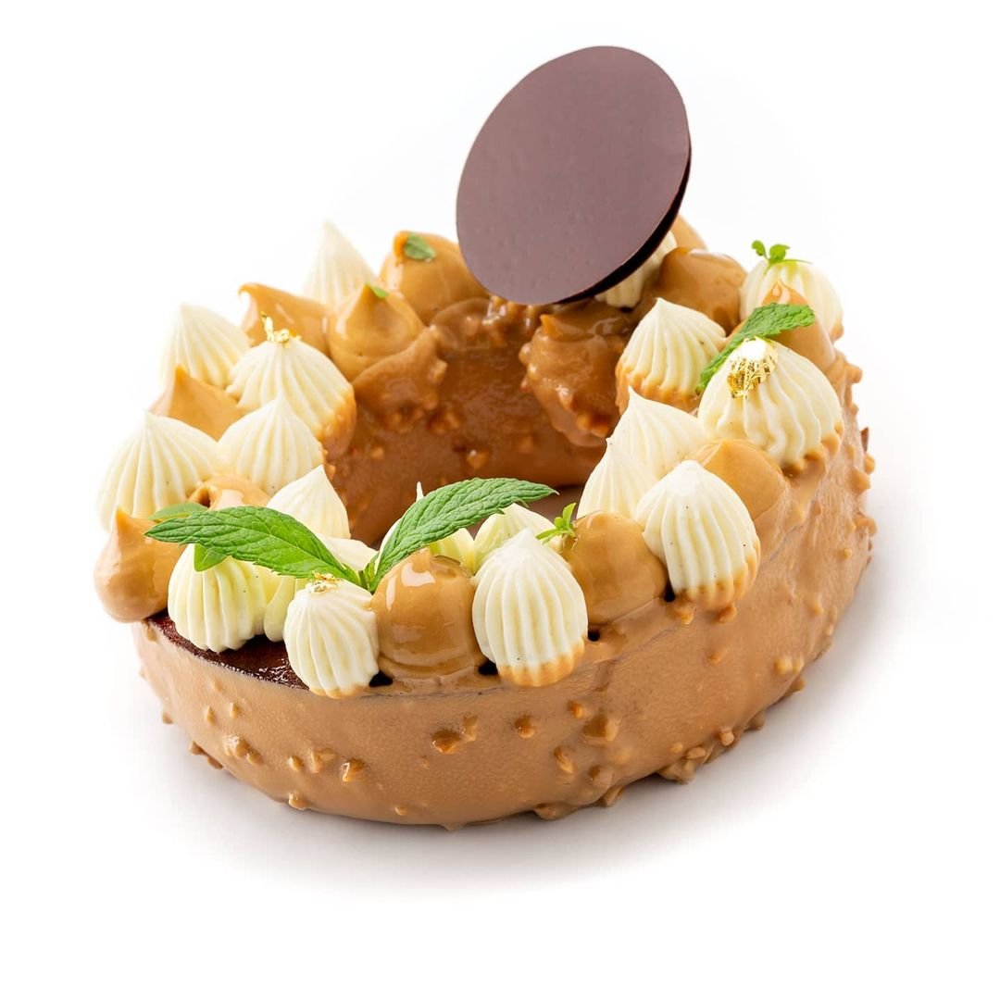

# Торт Карамельная Груша рецепт Hans Ovando

#### Ингредиенты

на 1 торт диаметром 16-18 см

**Карамелизованные томленые груши**

* 600 gr Груши Конференция
* 300 gr Сливки
* 200 gr Сахар
* 1 шт Ваниль

**Ванильный кекс со специями**

* 360 gr Сахарная пудра
* 290 gr Яйца
* 160 gr Сливки 35%
* 440 gr Мука
* 260 gr Сливочное масло
* 2 gr Соль
* 8 gr Разрыхлитель
* 2 шт Ваниль
* 1 gr Смесь специй

**Сироп для пропитки**

* 500 gr Вода
* 150 gr Сахар
* 4 шт Пустые стручки ванили
* 2 gr Экстракт ванили
* 1 gr Смесь специй

**Кофейная намелака**

* 90 gr Кофе Espresso
* 17 gr Сироп глюкозы
* 5 gr Желатин 220 bloom
* 100 gr Миндальное пралине
* 100 gr Карамельный шоколад
* 165 gr Сливки 35%

**Взбитый ганаш с бобами тонка**

* 120 gr Белый шоколад 35%
* 540 gr Сливки 35%
* 1 шт Ваниль
* ¼ шт Молотый боб тонка
* 5 gr Желатин

**Покрытие из карамельного шоколада и миндаля**

* 750 gr Карамельный шоколад 31%
* 75 gr Подсолнечное масло
* 200 gr Дробленый карамелизованный миндаль

#### Процесс

*Карамелизованные томленые груши*  
Очистить груши и нарезать на 6-8 долек  
Отдельно подогреть сливки с ванилью и отложить до использования.  
Сделать из сахара карамель, деглазировать горячими ванильными сливками, сварить тоффи  
Готовить груши в тоффи до состояния “al dente”. Убрать в холодильник на 24 часа.

*Ванильный кекс со специями*  
Смешать сахар, масло, ваниль и специи насадкой «весло».  
Постепенно добавить яйца и сделать эмульсию. Добавить муку с солью и разрыхлителем.  
Добавить сливки, перемешать, выложить в кондитерский мешок. Выложить в форму вместе с карамельными грушами, выпекать 25 минут при 165ºC.

*Сироп для пропитки*
Смешать все ингредиенты и довести до кипения. Остудить и добавить ром. Пропитать горячий кекс.

*Кофейная намелака*  
Растопить шоколад и смешать с пралине.Смешать горячий кофе с глюкозой, добавить желатин. Вылить на шоколад с пралине и пробить блендером. Добавить холодные сливки и сделать эмульсию. Убрать в холодильник на 24 часа.

*Взбитый ганаш с бобами тонка*  
Вскипятить сливки с бобами тонка. Дать настояться.  
Добавить распущенный желатин.  
В три приема ввести в растопленный шоколад, сделать эмульсию. Дать стабилизироваться 24 часа. Взбить, отсадить через кондитерский мешок  
  
*Покрытие из карамельного шоколада и миндаля*  
Растопить шоколад, добавить масло и миндаль. Перемешать и отложить для покрытия кекса.
