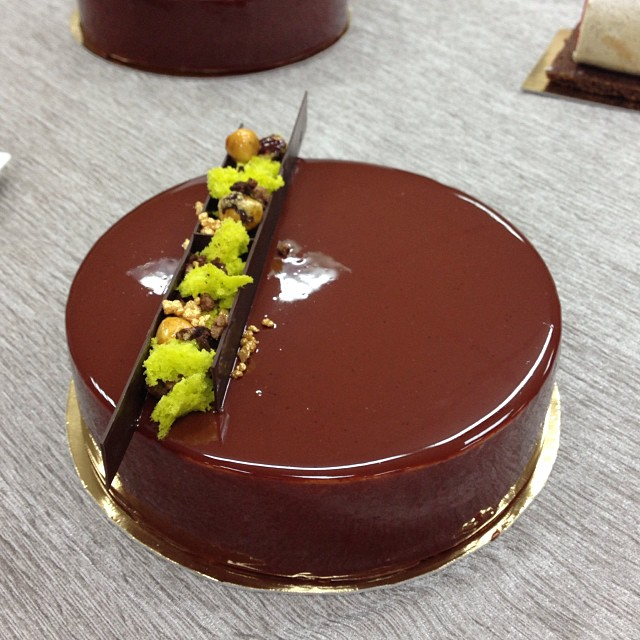

# Торт Киевский версия Nicolas Pierot

Состав: бисквит "Дакуаз" с фундуком, карамелизированный фундук, шоколадный масляный крем с коньяком, бисквит "мох" для декора

#### Ингредиенты

на 1 торт диаметром 16-18 см

**дакуаз с фундуком**

* 90 г белков,
* 70 г сахара,
* 40 г сахарной пудры + для посыпки,
* 75 г фундучной муки,
* 20 г муки.

**фундук в карамели**

* 22 г воды,
* 10 г сахара,
* 50 г фундука (без кожицы).

**легкий масляный крем с коньяком**

* 55 г молока,
* 33 г сахара (1),
* 43 г желтков,
* 33 г сахара (2),
* 190 г сливочного масла,
* 17 г белков,
* 7 г воды,
* 33 г сахара (3),
* 70 г темного шоколада,
* 17 г коньяка.

**гляссаж**

* 87 г сахара,
* 36 г воды (1),
* 87 г глюкозы,
* 48 г молока,
* 10 г сухого молока,
* 7 г желатина,
* 40 г воды (2),
* 108 г темного шоколада.

#### Процесс

*Дакуаз с фундуком.* Сахарную пудру смешать с обычной и фундучной мукой. Белки взбить с сахаром до плотности (птичьего клюва), всыпать сухую смесь, аккуратно и быстро перемешать лопаточкой снизу вверх. На бумаге начертить 3 круга или овала по внутренней части формы в которой будете собирать торт. Поверх бумаги с кругами выложить чистую, важно чтоб сквозь нее были видны круги. Переложить тесто в конд. мешок с круглой насадкой №10. Выложить по рисунку тесто так чтоб оно не выходило за чертеж. Густо посыпать коржи пудрой через ситечко. Выпекать при 170 (режим конвекция) около 18*25 минут. Точное время зависит от вашей духовки. Важно не "недопечь", иначе бисквит размокнет от крема. Коржи теплыми снять с бумаги. Охладить.

*Фундук в карамели.* Несколько орехов отложить для украшения. Воду и сахар соединить в сотейнике. Довести до 120 градусов, добавить орехи и постоянно помешивая готовим пока сахар на орехах не карамелизуется. Сначала орехи покроются белой сахарной коркой, но постепенно она начнет превращаться в карамель. Высыпать орехи на силиконовый коврик, отделить друг от друга. Остудить. Пересыпать в целлофановый мешок и измельчить в крупную крошку с помощью скалки.

*Легкий масляный крем с коньяком.* В одном сотейнике смешать воду и сахар (1), отставить в сторону. В другом молоко и сахар (2) довести до кипения, вылить на смесь желтков и сахара (3). Хорошо размешать, перелить обратно в ковшик и варить постоянно помешивая на слабом огне до 82-84 градусов. Переложить в чашу миксера, добавить измельченный шоколад. Взбивать пока масса не станет 20-25 градусов. По частям, не прекращая взбивать, добавить сливочное масло комнатной температуры, в конце влить коньяк. Взбивать не менее 10 минут. Из воды и сахара (1) сварить сироп, когда его температура достигнет 110 градусов, начинаем взбивать белки, как только сироп прогреется до 121 градуса, тонкой струйкой вливаем его в белки, не прекращая взбивать. Взбиваем до полного остывания, около 10 минут. Готовую меренгу, начиная с 1/3 вмешать лопаточкой в масляный крем.

*Гляссаж.* Желатин замочить в 40 г воды (2). Воду (1), глюкозу, сахар довести до 103 градусов. Снять с огня, добавить смесь сухого и цельного молока, набухший желатин. Вылить массу на шоколад, размешать, хорошо пробить блендером. Накрыть пленкой "вконтакт", отставить в холодильнике на ночь.

*Сборка*. (лицом вниз))). Форму проложить бордюрной лентой, дно затянуть пищевой пленкой. Поставить в холодильник на 5 минут. Крем выложить в кондитерский мешок с насадкой №10. На дно формы выложить слой крема толщиной в 1см, далее 1-й бисквит, слегка вдавливая его в крем, еще один слой крема, который посыпать фундуком, накрыть 2-м дакуазом, опять слой крема и фундука, и накрыть все 3-м бисквитом, слегка вдавливая и проворачивая (если форма круглая), края хорошо заполнить кремом, чтоб не было пустот. Поставить торт в морозилку на ночь или на сутки. На следующий день снять форму, убрать ленту, покрыть гляссажем, разогретым в микроволновке до температуры 28-30 градусов. Как мне показалось, при такой температуре гляссаж слегка густоват, поэтому следующий раз буду заливать при 32-33 градусах. Дать гляссажу стечь,с помощью шпателя подвернуть подтеки под торт, выложить на блюдо или подставку, украсить по своему вкусу.
