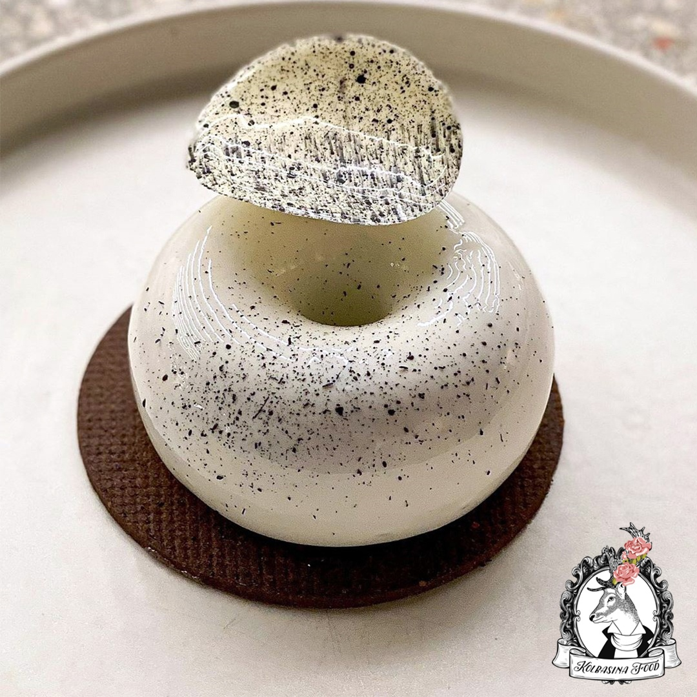
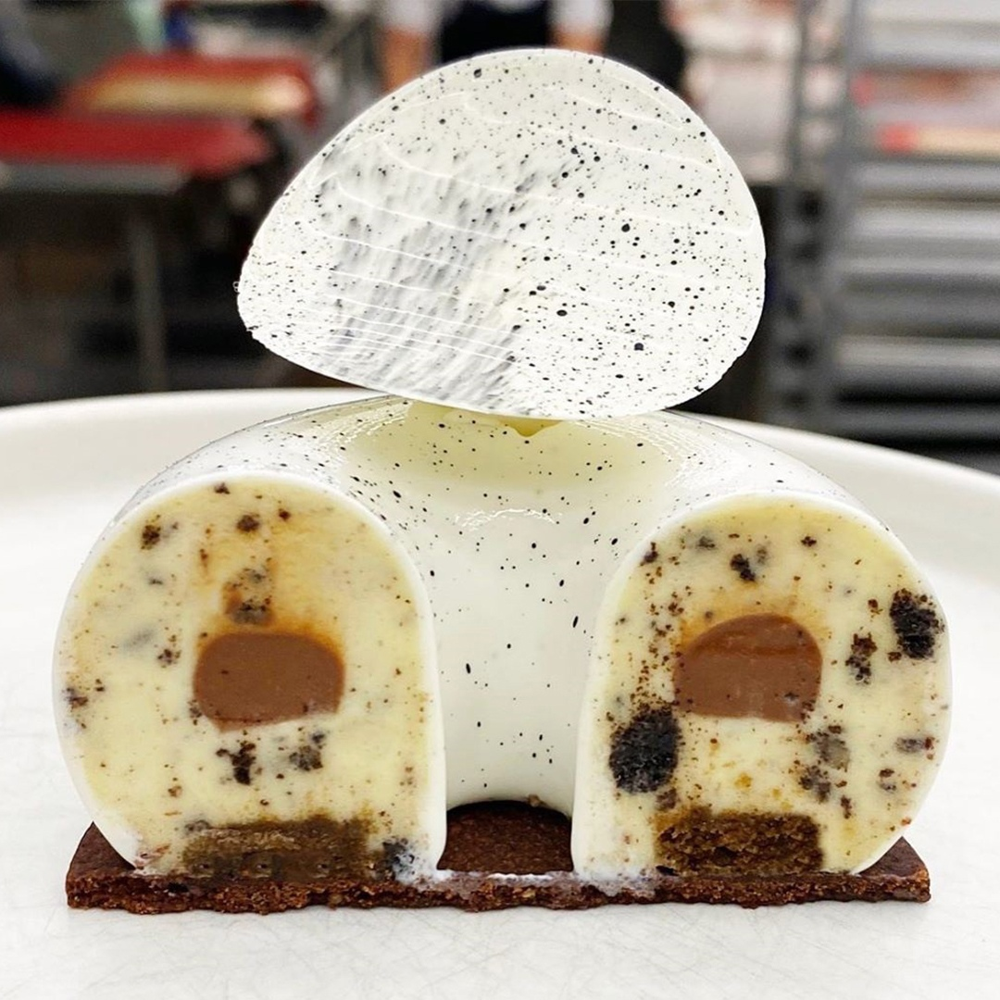

# Пирожное “Oreo”

Мусс с вкраплениями хрустящего печенья: мусс с печеньем, шоколадная намелка, шоколадный бисквит, хрустящее сабле

#### Ингредиенты
На форму “Lotus” от Pavoni, 2100ml

**мусс с печеньем**

* Молоко – 400г
* Сливки 35% - 225г, взбить до лёгких пик
* Белый шоколад 35% - 400г
* Шоколадное печенье – 225г, лучше Oreo
* Листовой желатин, серебряный – 10г

**шоколадная намелака**

* Молоко – 100г.
* Сироп глюкозы – 6г.
* Шоколад горький Manjari 64% - 140г.
* Желатин листовой, серебряный – 3г.
* Холодные сливки 35% - 200г.

**шоколадный бисквит**

* Желатин листовой, серебряный – 18г.
* Вода – 125г.
* Сахар – 225г.
* Сироп глюкозы – 225г.
* Белый шоколад 35% - 225г.
* Сгущённое молоко – 160г.
* Нейтральная глазурь Valrhona absolut – 90г.
* Белый краситель – 8г.

**белая зеркальная глазурь**

* Желатин листовой, серебряный – 18г.
* Вода – 125г.
* Сахар – 225г.
* Сироп глюкозы – 225г.
* Белый шоколад 35% - 225г.
* Сгущённое молоко – 160г.
* Нейтральная глазурь Valrhona absolut – 90г.
* Белый краситель – 8г.

#### Процесс

*Мусс с печеньем* Печенье мелко крошим. Желатин замачиваем в ледяной воде на 10 минут. Молоко доводим до кипения, снимаем с огня и вмешиваем отжатый желатин до его полного включения. Выливаем треть молока поверх шоколада и начинаем энергично взбивать венчиком до получения гладкой текстуры. Продолжая взбивать, вливаем оставшееся молоко, сохраняя текстуру. Когда ганаш остынет до 28С, при помощи силиконовой лопатки вмешиваем взбитые сливки, затем крошку печенья.

*Шоколадная намелака* Желатин замачиваем в ледяной воде на 10 минут. Молоко с глюкозой доводим до кипения, снимаем с огня и вмешиваем отжатый желатин до его полного включения. Выливаем горячую смесь поверх растопленного шоколада и эмульгируем погружным блендером. Вмешиваем холодные сливки и снова пробиваем блендером. Убираем в холодильник на сутки, после перекладываем в кондитерский мешок перед сборкой.

*Шоколадный бисквит* Духовку разогреваем до 180С. В деже планетарного миксера с насадкой венчик смешиваем сухие ингредиенты с растительным маслом и яйцами, взбиваем 6 минут на максимальной скорости. Вливаем молоко и взбиваем ещё 2 минуты на средней скорости. Распределяем тесто в ровный слой по противню, застеленному пергаментом, и выпекаем 10-15 минут. Достаём, даём остыть и вырезаем кольца под размер формы.

*Белая зеркальная глазурь* Желатин замачиваем в ледяной воде на 10 минут. В сотейнике доводим до кипения воду, сахар и глюкозу, снимаем с огня и вмешиваем отжатый желатин до его полного включения. Выливаем горячую смесь поверх шоколада и эмульгируем погружным блендером. Вмешиваем сгущённое молоко и нейтральную глазурь. Продолжая пробивать погружным блендером, добавляем краситель. Убираем глазурь в холодильник на сутки. Рабочая температура 35С.

*Сборка*. В форму отсаживаем слой мусса, заполняя форму наполовину. Далее из кондитерского мешка по кугу отсаживаем полоску намелаки, закрываем муссом и вставляем бисквит, слегка утапливая его. Замораживаем. Замороженный пирожные покрываем глазурью, при помощи кисти с жёсткой щетиной сбрызгиваем чёрным какао-маслом и устанавливаем на диск сабле.

_Рецепт от Антонио Башура_