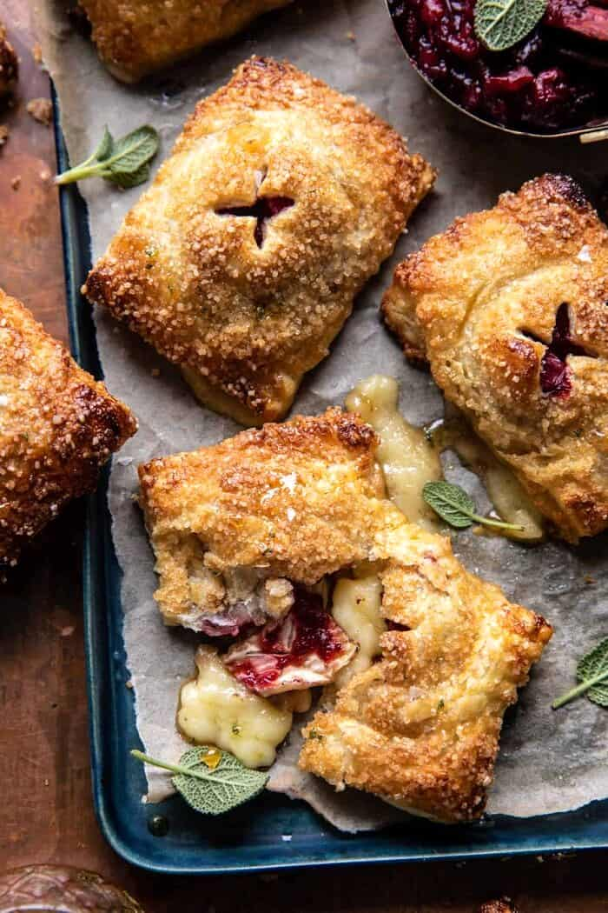

# Mini Pastry Wrapped Cranberry Baked Brie Bites \| Бри с клюквой в слоеном тесте

#### Ингредиенты

на 12 шт

* 200г свежей клюквы
* 2 столовые ложки коричневого сахара
* 1 палочка корицы
* шалфей веточка
* 125г апельсинового сока
* 2 чайные ложки апельсиновой цедры
* 1 коробка (450 г) замороженного слоёного теста
* 230г сыра Бри
* 1 яйцо
* крупный сахар
* fleur de sel
* мед

#### Приготовление

Клюкву, коричневый сахар, корицу, шалфей и апельсиновый сок поместить в кастрюлю среднего размера и поставьте на сильный огонь, довести смесь до кипения, размять клюкву вилкой. Продолжать варить 10 минут, пока джем не уменьшится в объеме и не загустеет на 1/3. Удалить шалфей, добавить цедру апельсина и соль, снять с огня.

Разогреть духовку до 200 °C. Застелить противень пергаментной бумагой.

Слоеное тесто разморозить, раскатать если нужно и разделить на 24 прямоугольника. Положить на половину прямоугольников 1 кубик бри и примерно 1 чайную ложку клюквенного джема, смазать края яйцом. Накрыть оставшимися прямоугольниками и запечатать края, защипнув их обратной стороной вилки, выложить на подготовленный противень, охладить в холодильнике 20 минут.

Смазать верх взбитым яйцом, сделать небольшие надрезы крест накрест, посыпать крупным сахаром. Выпекать 15-20 минут до золотистого цвета. Посыпать fleur de sel и полить медом.

_halfbakedharvest.com_
