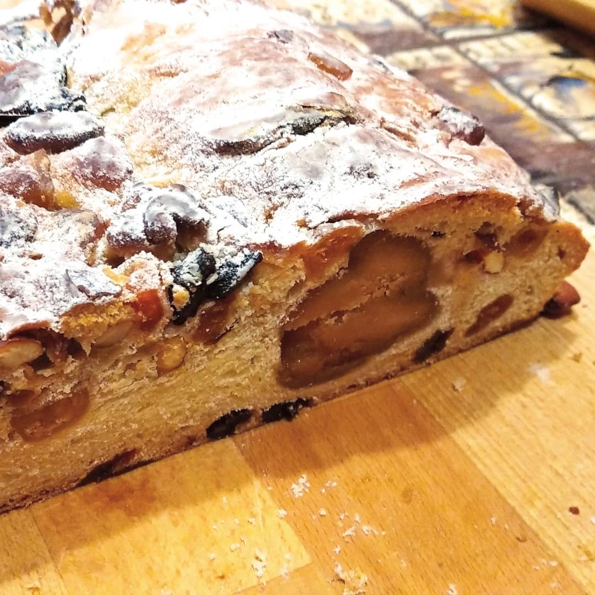

# Дрожжевой штоллен (эльзасская версия) \| Christollen

#### Ингредиенты
на 1 большой штоллен или 2 маленьких

*можно сделать мини-штоллены в виде шариков*

**для закваски:**

* 50 г тёплого молока
* 60 г муки
* 10 г свежих дрожжей

**для начинки:**

* 360 г цукатов и орехов
* 1 чл корицы
* 4 стл рома
* 250 г марципана
  
**для теста:**

* 380 г муки
* 1 яйцо
* 80 г сахара
* 120 г тёплого молока
* 100 г масла комнатной температуры
* 10 г свежих дрожжей
* цедра 1/2 апельсина
* цедра 1/2 лимона
* 1/2 чл корицы
* 5 г соли

**для отделки:**

* 30 г растопленного сливочного масла
* сахарная пудра

#### Приготовление

Орехи и цукаты крупно порезать, залить ромом, добавить корицу. Оставить мариноваться на сутки, накрыв пленкой.

Смешать ингредиенты закваски до однородности, сверху засыпать 380 г муки и оставить подниматься в теплом месте 45 минут, не накрывая. Через 45 мин на муке должны появиться трещинки от поднявшейся закваски. 

Добавить молоко, яйцо, масло, сахар, соль, корицу и цедру. Замесить тесто 5 минут в миксере с насадкой крюк, тесто должно быть эластичным почти не липким. Накрыть влажным полотенцем и поставить в теплое место подниматься на час.

Тесто выложить на присыпанный мукой стол. Разделить на нужное количество прямоугольников. Выложить на прямоугольник цукаты и орехи, смешать с тестом, снова сформировать прямоугольник. На одну часть выложить колбаску марципана, сложить вдоль колбаски пополам, затем сформировать загиб сверху. Переложить на противень с бумагой или силиконовым ковриком, поставить в теплое место подходить на час.

Духовку разогреть до 170С. Выпекать 40 мин маленький или 60 мин большой. Достать из духовки, смазать растопленным маслом, поместить в духовку на 2 минуты. Повторить еще 2 раза. Готовый штоллен остудить, посыпать пудрой.

Для выдерживания завернуть герметично в фольгу и два слоя пленки. Выдерживать минимум неделю в прохладном месте, но не в холодильнике.

*@christophefelder*