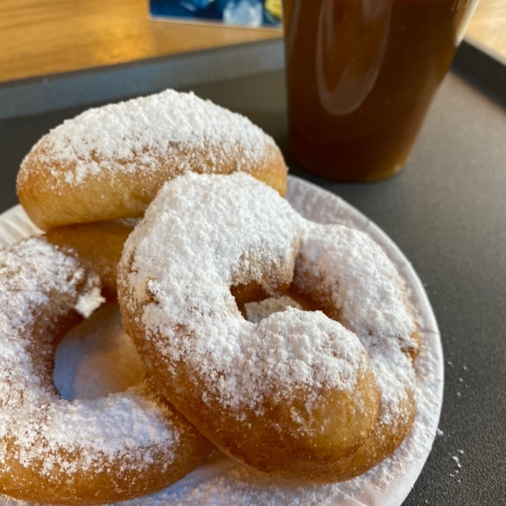

# Пышки

#### Ингредиенты

* Мука 510г
* Вода 345г
* Сахар 60г
* Соль 5г
* Яйцо 70г
* Дрожжи сухие 10г

#### Приготовление

Тёплая вода, яйцо, сахар, дрожжи, соль смешать.
Добавить муку.
Вымесить, дать подойти.
Сформовать шарики.
Дать подойти повторно, сделать дырку пальцами и растянуть
Жарить в большом количестве масла
Посыпать сахарной пудрой.

_@julspastry_
