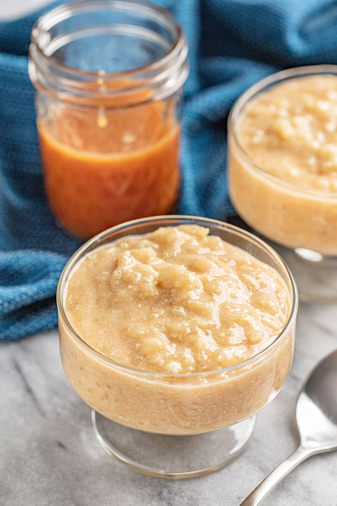

# Печеный карамельный рисовый пудинг

#### Ингредиенты:

* сахар 150 г
* сливочное масло 225 г
* круглый рис 250 г
* ванильный экстракт 1 ч. л.
* молоко 3,2% 1,5 л
* сливки 33% 300 мл
* соль 2 г

**для соуса:**
* молоко 3,2% 150 г
* сливки 33% 230 г
* 3 крупных желтка
* сахар 70 г
* Ваниль 1 ч л
* мелкий изюм 50 г, замочить в коньяке

#### Приготовление:

Молоко и сливки разогреть в сотейнике и держать горячими. Масло и сахар выложить в большой сотейник и готовить на медленном огне, не помешивая. Масло должно растаять и начать пениться, а сахар плавиться и темнеть. Не нагревать слишком сильно. Когда образуется карамель, высыпать рис и тщательно перемешать, масса будет липкой и тягучей. Влить молоко и сливки, соблюдая осторожность. Размешать и добавить ванильный экстракт. Дождаться растворения карамели, накрыть крышкой и поставить в духовку при 175ºС на 1,5—2 часа. Рис должен полностью приготовиться, а жидкость впитаться. 

Молоко и сливки соединить в сотейнике, довести до кипения. Снять с огня, охладить до 80ºC. Желтки слегка взбить венчиком в миске. Влить ¼ молока в желтки, перемешать и перелить всю массу к остальному молоку. Поставить на малый огонь или на водяную баню. Готовить до загустения, не доводя до кипения, снять с огня и процедить сквозь тонкое сито. Добавить изюм, остудить.

Подавать горячим или разогретым с соусом.