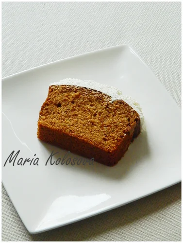

# Медовый кекс с зелёным чаем, имбирём и лимоном

Изначально это должен был быть кекс с чаем earl grey, использовался зеленый чай.

#### Ингредиенты

на 2 стандартных кексовых формы

**для теста:**

* 160 гр сливок
* 4 ч.л. чая
* 280 гр муки
* 9 гр разрыхлителя
* 1/4 ч.л соли
* 1 ч.л соды
* 350 гр мёда
* цедра одного лимона
* 5 яиц
* 115 гр растительного масла

**для крема:**

* маскарпоне
* сливки
* мёд
* тёртый имбирь

#### Приготовление

Сливки довести до кипения, добавить чай, накрыть плёнкой и оставить до полного остывания. Процедить.  
Снова взвесить и добавить выпарившееся количество сливок.

Смешать сливки, мёд, цедру, яйца и масло. Пробить блендером.

Просеять муку, разрыхлитель, соду, соль. Добавить к предыдущей смеси, пробивая блендером до однородности.

Залить смесь в форму.

Выпекать при 170 С в течении 40-60 мин, в зависимости от формы \(для маленьких 15-20 мин\).

Смешать маскарпоне, сливки, мёд и имбирь. Украсить холодный кекс кремом.

_maria-cuisine.livejournal.com_
