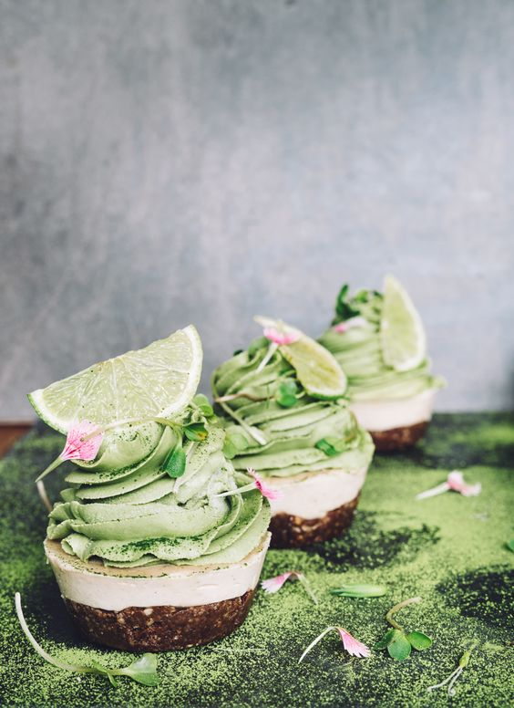

# Капкейки Матча-лайм

#### Ингредиенты

на 10 капкейков

* какао-порошок 30 г
* вода 50 мл.
* пшеничная мука 125 г
* сода 1/4 ч.л.
* разрыхлитель 1/4 ч.л.
* соль 1/4 ч.л.
* сливочное масло 75 гр
* сахар 100 г
* яйца 1 шт
* ванильный сахар 0.5 ст.л.
* сметана 60 г

**ванильный крем:**

* 250 г крема Шантальи (15% маскарпоне и 10% сахара)

**крем матча - лайм:**

* 250 г крема Шантальи (10% сахара)
* 2 столовые ложки порошка матча
* сок 1 лайма

#### Приготовление

Какао-порошок залить кипятком и перемешать до однородности.  
Масло и сахар в ковше нагреть до полного растворения сахара, затем взбить пока не остынет до комнатной температуры. По одному добавить яйца, взбивая после каждого. Добавить ванильный сахар и какао-смесь, взбить до однородности.  
Муку просеять с солью, содой и разрыхлителем. В три приема добавить в яично-шоколадную смесь муку, чередуя со сметаной.  
Выложить тесто в формы наполовину. Выпекать в разогретой до 180 градусов духовке до сухой спички, около 25-30 минут. Вынуть и остудить на решетке. 

Приготовить ванильный крем, заполнить формы, заморозить.

Приготовить крем матча. Выложить шапочки на замороженные кексы.
