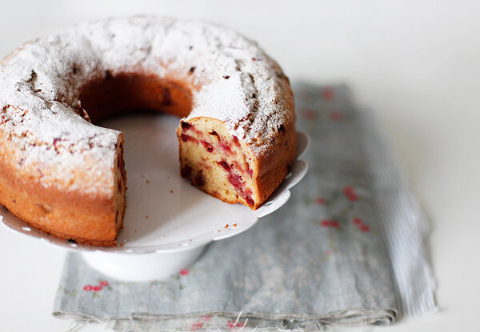

---
image: ../cakes/pics/lingon-cake.jpg
---
# Пряный кекс с брусникой

#### Ингредиенты

на круглую форму с дыркой 23 см

* 2 яйца
* коричневый сахар 200 г
* сметана 300 г
* мука 300 г
* сливочное масло 50 г
* брусника 200 г
* разрыхлитель 1 ч л  с горкой
* цедра половины апельсина
* корица 1 ч л
* молотый имбирь 1 коф л
* мускатный орех 1/4
* гвоздика 5 шт
* молотый кардамон 1 коф л

#### Приготовление

Замороженную бруснику залить теплой водой и разморозить.

Смешать в деже сахар, цедру и пряности. Влить яйца, взбить на максимальной скорости до посветления. Добавить сметану, осторожно перемешать, смесь станет более жидкой. Всыпать муку с разрыхлителем, аккуратно перемешать. Влить растопленное масло комнатной температуры и добавить бруснику, перемешать.

Переложить тесто в форму, смазанную маслом и посыпанную мукой. Выпекать при 150С 50 минут, до пружинящей текстуры. 

Смазать растопленным маслом и посыпать сахарной пудрой еще теплый кекс. Оставить до полного остывания.

*lj: chadeyka*
