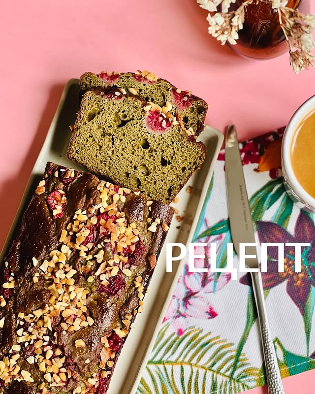

# Матча кекс с малиной

#### Ингредиенты

* миндальная мука 100 г
* мука 120 г
* кокосовый сахар или тростниковый 70 г
* разрыхлитель 10 г
* матча 3 ч л
* 2 яйца
* мягкий творог 200 г
* яблочное пюре 100 г
* малина
* амаретто или миндальный экстракт
* миндальные лепестки или миндальная крошка

#### Приготовление

Смешать все сухие ингредиенты. Добавить влажные ингредиенты и хорошо перемешать. Выложить тесто в кексовую форму. Посыпать малиной и миндалём. Выпекать при 170С 60 минут, до сухой спички.

*IG: foodedlife*