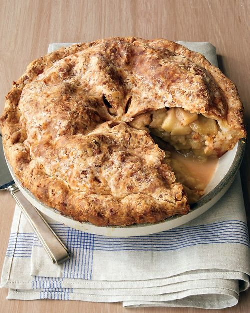

# Яблочный пирог с сырной корочкой из Чеддера

#### Ингредиенты

форма 24 см

* 20 г муки
* 20 г свежего лимонного сока
* 4 больших яблока Granny Smith
* 40 г коричневого сахара
* 1 чайная ложка молотой корицы
* 1 большое яйцо

**для сырного теста:**

* мука 255 г
* сахар 10 г
* сливочное масло 140 г
* чеддер 140 г
* холодная вода 50 - 100 г

#### Приготовление

Разогреть духовку до 200 градусов конвекция.

Приготовить тесто: Смешать муку, сахар и соль в фуд-процессоре в режиме пульса. Добавить масло и чеддер, смешать в комбайне до получения крошки. Добавить 50 г холодной воды. Мешать пока тесто не станет рассыпчатым, оно должно слепляться при сжатии \(при необходимости добавить до 50 г воды по 1 ложке\)

Выложить тесто на посыпанную мукой поверхность и разделить \(одна часть должна быть немного больше\). Сформировать диск из каждой части, завернуть в полиэтилен по отдельности и охладить около часа.

На слегка посыпанной мукой рабочей поверхности, раскатать меньший диск теста до толщины примерно 0.5 см. Полученное тесто поместить в форму и сформировать бортики.

Очистить яблоки и нарезать их на дольки. Смешать в миске с лимонным соком. Добавить сахар, муку, корицу и соль, перемешать.

Заполнить форму с тестом яблочной начинкой, края теста смазать водой. Вырезать небольшой круг или щели в верхней части теста, накрыть форму и слепить края с нижней частью теста, сформировав бортик.

Слегка взбить яйцо с ложкой воды, смазать яичной смесью верхушку пирога.

Выпекать 20 минут, затем уменьшить температуру до 180 градусов и выпекать золотисто-коричневой корочки еще около 40 минут. Остудить на решетке 4 часа или ночь.

_marthastewart.com_
