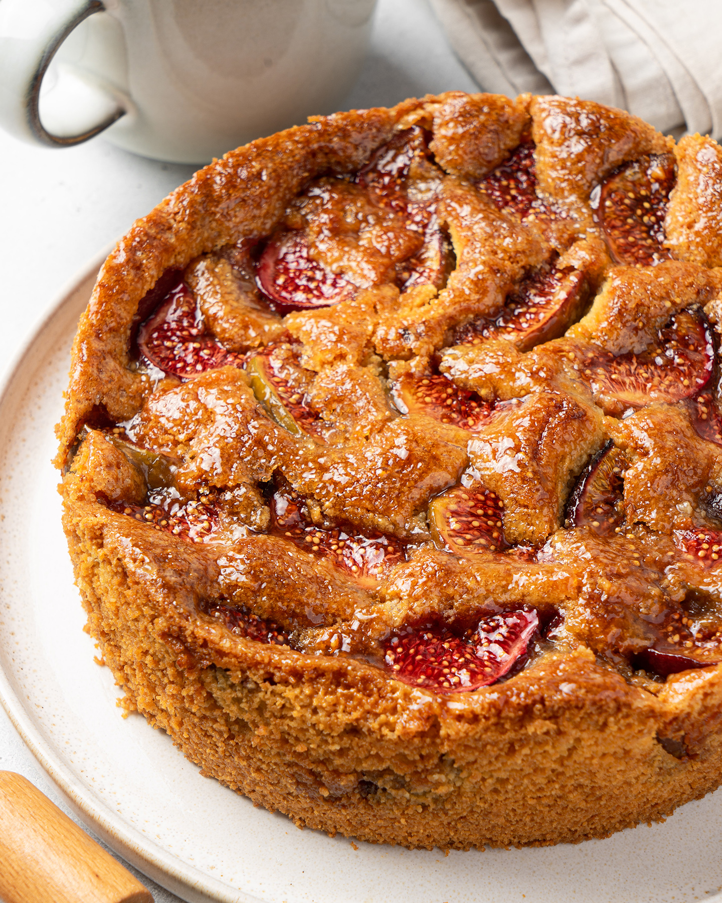

# Фиговый пирог

#### Ингредиенты
на круглую форму 18 см

* сахар демерара 100 г
* сливочное масло 82,5% 170 г
* яйца 2 шт
* мука 120 г
* разрыхлитель 7 г
* миндальная мука 70 г
* сметана 30% или нежирный йогурт 55 г
* инжир свежий
* нейтральная глазурь
* сахар демерара

#### Приготовление

Ингредиенты заранее вынуть на стол, чтобы они были одной температуры.

Инжир промыть, щедро срезать верхние хвостики и нарезать на крупные куски.

Взбить в чаше мягкое сливочное масло с сахаром демерара. По одному добавить яйца. Ввести муку, разрыхлитель и миндальную муку. Добавить жирную сметану.

Металлическое кольцо на 18 см обернуть плотной фольгой. Наполнить кольцо тестом.

Щедро и плотно покрыть инжиром всю поверхность будущего пирога. Посыпать сверху сахаром демерара.

Выпекать при 170 °C около часа до хорошего румянца.

Нейтральную глазурь разогреть в микроволновке до жидкого состояния и смазать кисточкой горячий пирог.

Дать пирогу остыть в кольце и аккуратно перенести на блюдо. Убрать в холодильник на самую холодную полку на 5 часов или на ночь. Подавать с мороженым или йогуртом.

*Andy Chef*