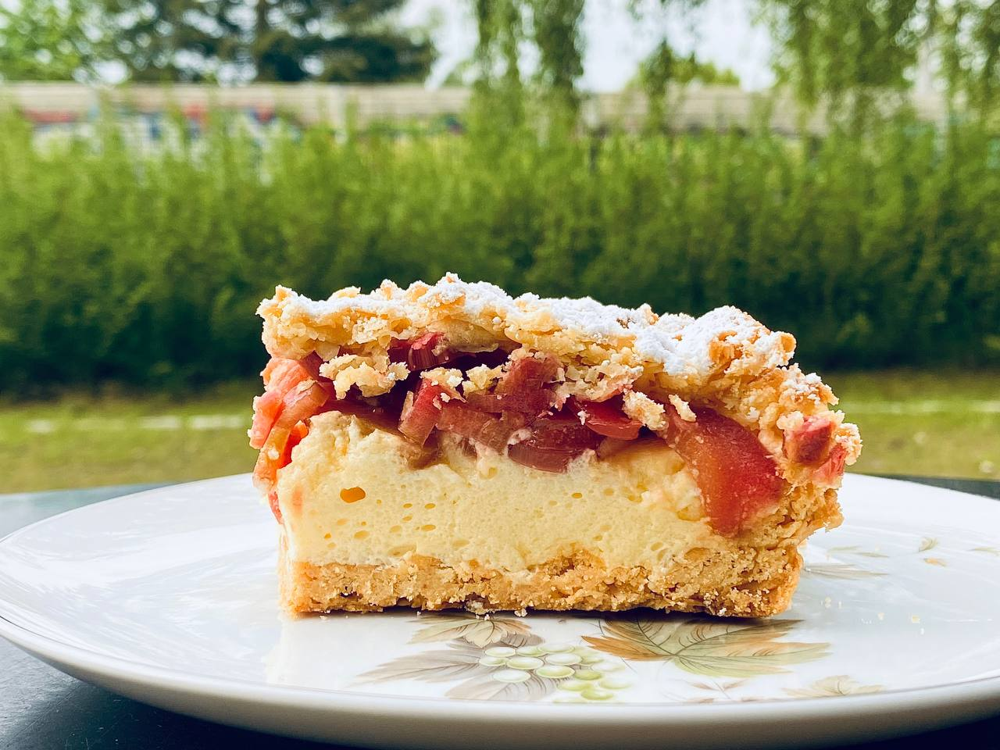

# Ревеневый пирог с меренгой и крамблом

#### Ингредиенты
на форму 30х20 см или круглую D28 см

* 550 г - ревень, очищенный и нашинкованный 3-4 мм 
* 60 г - сахар
* 30 г - сахар 2
  
**для крамбла**

* 400 г - мука в/с
* 7 г - разрыхлитель
* 15 г - сахарная пудра
* 1 г - соль
* 250 г - холодное сливочное масло
* 5 шт - желтки

**для меренги**

* 5 шт - белки
* 0,5 г - винная кислота
* 180 г - сахар
* 8 г - ванильный сахар
* 1 г - соль
* 80 г - кукурузный крахмал
* 60 г - растительное масло
* 40 г - оливковое масло
  
#### Приготовление

Приготовить крамбл. Смешать все сухие ингредиенты. Масло нарезать кубиками 1-2 см. Насадкой лопатка очень быстро растереть масло с мучной смесью до получения грубой крошки. Влить желтки и смешать до однородности. Не вымешивать. Разделить тесто на три равных части, скатать шарики и убрать в морозильник. Хранить от 2 часов до 1 месяца. Достать тесто из мороза. Форму смазать растительным маслом и едва припудрить мукой. Натереть два из трех шара теста на крупной терке в форму, быстро, не приминая, сформировать бортики и распределить крошку по дну. Тесто не должно быть сплошной лепешкой. Выпекать крамбл 20 мин при 175 градусах. Полностью остудить, идеально, если в морозильнике.  

Приготовить меренгу. В дежу вылить белки и добавить винную кислоту. Взбить белки до твердых пиков. Взбивая, постепенно всыпать сахар и ванильный сахар. Взбивать до получения стойкой и мощной меренги. Взбивая, всыпать соль и крахмал. Перемешать до однородности. Влить все масло и перемешать до однородности, 10-15 сек или сколько потребуется. Можно остановить миксер и помочь ему силиконовой лопаткой

Ревень очистить и нашинковать ломтиками 3-4 мм, заранее пересыпать первой порцией сахара и дать ему раствориться. Выложить меренгу на холодный краст. Отжать ревень от жидкости. Пересыпать ревень сахаром2, сразу высыпать ревень поверх меренги. Равномерно натереть крупной теркой остаток теста поверх ревеня. Выпекать при 175 градусах в духовке с конвекцией 40 мин. Вынуть из духовки и посыпать из мелкого сита сахарной пудрой. Дать полностью остыть

*Tg: fullscoop*
