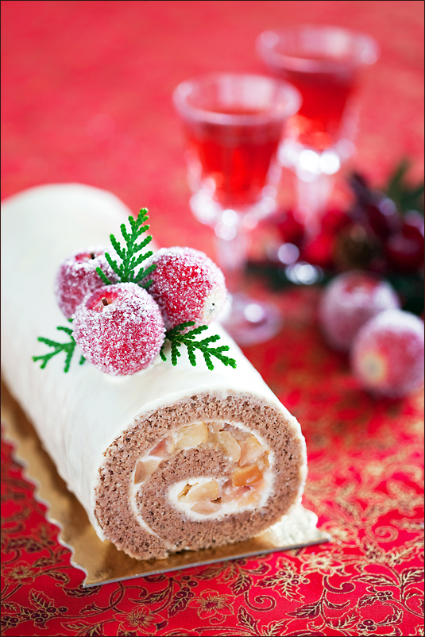

# Рулет с яблоками и корицей

#### Ингредиенты

* 140 г пшеничной муки
* 140 г сахара
* 4 куриных яйца
* 10 г разрыхлителя
* 1 ч. л. молотой корицы
* 1/2 ч. л. порошка бобов тонка
* 1/4 ч. л. порошка имбиря
* 1 щепотка морской соли

**для начинки:**

* 450 г сливочного сыра
* 1 ст. л. сахара
* 1 ст. л. лимонного сока
* 2 яблока сорта Гренни Смит
* 50-100 мл кленового сиропа
* лимонный сок
* растительное масло

**для декора:**

* 60 г белого шоколада
* 50 г масла

#### Приготовление

Противень для выпечки смазать растительным маслом и застелить бумагой для выпечки. Духовку разогреть до 175-180 градусов.  
Растереть маскарпоне с сахаром и лимонным соком. Яблоки очистить, мелко нарезать, сбрызнуть лимонным соком и слегка обжарить на небольшом количестве растительного масла. Добавить сироп и тушить на маленьком огне до мягкости, остудить. Смешать яблоки с маскарпоне, консистенция начинки должна быть похожа на взбитые сливки.

Муку просеять, солью и специями. Добавить желтки, тщательно перемешать не взбивая. Взбить белки с сахаром до мягких пиков, смешать аккуратно обе смеси. Вылить тесто на подготовленный противень, придать форму прямоугольника (квадрата) кондитерской лопаткой, разровнять поверхность спатулой. Выпекать на верхнем уровне предварительно разогретой духовки 6-8 минут.

Застелить рабочую поверхность бумагой для выпечки или кухонным полотенцем, слегка присыпать сахаром. Перевернуть готовый бисквит на бумагу или полотенце и аккуратно удалить бумагу для выпечки на которой он выпекался. Выложить на горячий бисквит сливочный сыр и яблоки. Распределять начинку и сворачивать надо быстро, пока бисквит горячий, он очень эластичный. С той стороны, с которой начинаем сворачивать рулет более толстым слоем и совсем тонким с противоположной стороны. С помощью бумаги или полотенца свернуть рулет, остудить, плотно завернуть в ту же бумагу и убрать в холодильник на 3-4 часа или на ночь.
Для глазури растопить масло с шоколадом, взбить блендером. Полить холодный рулет теплой глазурью.

Противень смазываю растительным маслом для того, чтобы бумага для выпечки к нему прилипла и не поднималась во время выпекания, деформируя края бисквита.

*lj: laperla-foto*
