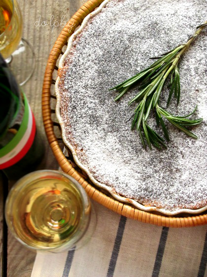

# Пирог с медом, кедровыми орехами и розмарином

#### Ингредиенты

на форму 24 см

* основа для тарта \(с кусочками розмарина\)
* кедровые орехи 120 г
* сливочное масло 50 г
* сахар 50 г
* 2 яйца
* мед 65 мл
* цедра одного лимона
* мука 25 г
* сахарная пудра для украшения

#### Приготовление

Пока печется основа, слегка обжарить кедровые орешки на сковороде.

Масло взбить с сахаром до светлого цвета и кремообразного состояния. По одному добавить яйца, взбивая после каждого. Добавить мед и лимонную цедру, снова взбить. Добавить муку и орехи, перемешать. Вылить начинку в основу.

Выпекать около часа при 180С конвекция до золотистого цвета. Если верх слишком быстро зарумянится, можно накрыть его фольгой. Готовый тарт остудить перед подачей.

Посыпать сахарной пудрой и подавать с маскарпоне, взбитыми сливками, кремом фреш или сметаной.

_lj: dolphy-tv_
