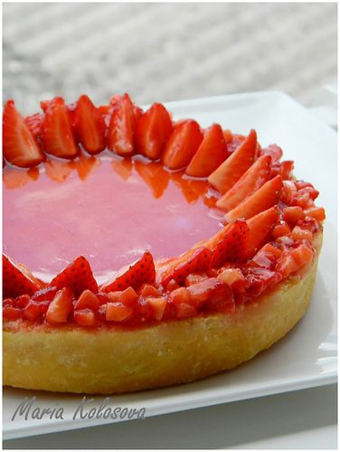

---
image: ../../pics/tart-strawberry-cheesecake.jpg
---
# Тарт с а-ля чизкейковой начинкой и клубникой

#### Ингредиенты:

на тарт диаметром 18 см:

* песочное тесто \(sablée\)
* 1 яйцо
* 1 яичный желток
* 500 гр fromage blanc _\(для замены пробить в блендере мелкозернистый творог или рикотту с йогуртом\)_
* 70 гр сахара
* ванильный экстракт
* 200-300 гр клубники
* клубничный наппаж + желе

#### Приготовление:

Fromage blanc отвесить на сито на 2 часа минимум. _В случае замены пропустить этот шаг_

Смешать fromage blanc с сахаром и ванильным экстрактом. Добавить яйцо и желток.

Тесто выпечь под грузом при 180С в течении 10 минут. Груз снять.

Залить в тарт жидкую смесь и выпекать при 180С в течении примерно 40 минут \(середина не должна остаться жидкой\).

Остудить. Выложить клубнику.

_lj: maria-cuisine_

