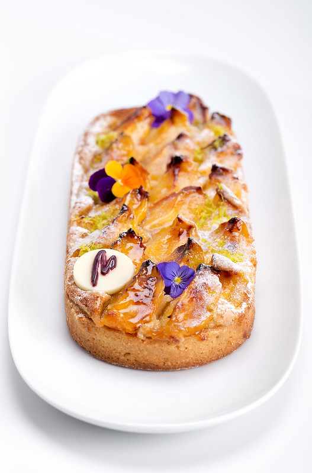

# Фисташково-абрикосовый тарт

#### Ингредиенты:

на 2 тарта 20 см

**для теста:**

* 250 г муки
* 150 г сливочного масла
* 95 г сахарной пудры
* 3 г соли
* 30 г молотого миндаля
* 60 г яйца

**для крема:**

* 120 г сливочного масла
* 120 г сахара
* 110 г яиц
* 120 г миндальной пудры
* 60 г муки
* 40 г фисташковой пасты
* 5 г сухого молотого розмарина (опц.)

* 300 г свежих абрикосов
  
Сахарная пудра, фисташки для украшения

#### Приготовление

Приготовить песочное тесто. Выпечь до полуготовности при 150С.

Все ингредиенты для крема должны быть комнатной температуры. Растереть размягченное масло с сахаром до однородности, добавить яйца, миндальную пудру, фисташковую пасту, при желании - розмарин. Все расмешать венчиком (не взбивая!), в конце просеять в смесь муку. Выложить спиралью крем в полувыпеченную корзинку для тарта так, чтобы он доходил до половины ее высоты, разровнять, выложить сверху нарезанные на четвертинки абрикосы. Чуть-чуть присыпать сахаром для карамелизации абрикосов, запечь при 175С до готовности (20-30 минут, в зависимости от духовки).

Украсить сахарной пудрой, рублеными зелеными фисташками.

*maria-selyanina*