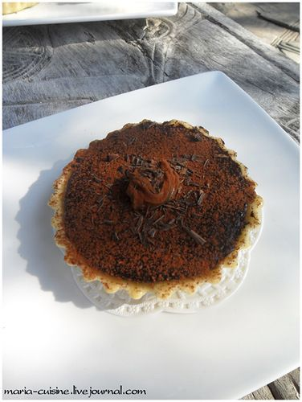

# Тарталетки с шоколадом и карамелью \| Tartelettes chocolat-caramel

#### Ингредиенты

на 4 тарталетки

* тесто brisée \(делать на 250 гр муки, использовать половину получившейся порции\)
* 150 гр темного шоколада
* 50 гр сливочного масла слабой соли
* 20 гр сливочного масла
* 180 мл сливок
* 125 гр сахара
* 4 ч.л. каштанового крема \(опционально\)

#### Приготовление

Тесто тонко раскатать и разрезать на 4 части. Заложить тесто в 4 формочки для тарталеток. Накрыть пергаментной бумагой и засыпать кондитерскими шариками \(или фасолью, рисом и т.д.\). Выпекать при 180 С 15 минут. Остудить.

Для карамели: На медленном огне нагреть сахар с 2 ст.л. воды до коричневого цвета. Снять с огня.

Добавить 80 мл сливок. Вернуть на огнь, постоянно помешивая. Снять с огня, немного остудить и ввести масло слабой соли, порезанное на кубики.

Залить карамель в тарталетки. Отправить в холодильник застывать.

Для ганаша: разогреть 100 мл сливок. Снять с огня. Добавить рубленый шоколад и сливочное масло. Отсадить ганаш на карамель при помощи кондитерского мешка или любым другим способом.

Декорировать каштановым кремом.

_lj: maria-cuisine_
