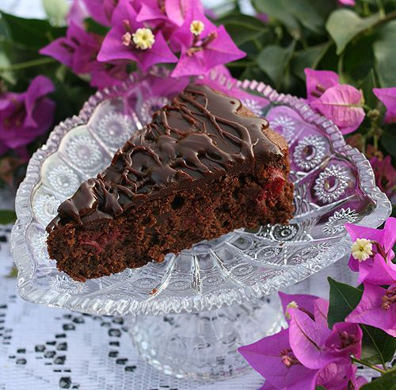

# Шоколадный торт с вишней

#### Ингредиенты
на форму 26 см или 2 формы 17.5 см

**для коржей:**

* 300 г горького(52-60%) шоколада
* 300 г сливочного масла
* 1 ст ложка порошка растворимого кофе
* 4 ст.ложки вишневого ликера или бренди
* 250 г ( 1+1/4 ст.) сахара
* щепотка соли
* 7 средних яиц
* 20 г мука
* 18 г миндальная мука
* 300 г замороженной вишни без косточек (разморозить и обсушить) или 300 г вишни из компота (сцедить жидкость)

**для ганаша:**

* 125-130 г горького шоколада
* 125 мл жирных(32-38%) сливок
* 1.5 ч ложки хорошей ванильной эссенции или бренди
  
#### Процесс

Шоколад и масло порезать на небольшие куски,добавить кофе и растопить на водяной бане. Добавить сахар и алкоголь и все хорошо перемешать. Дать остыть 4-5 мин.  
В миску с шоколадной массой добавить щепотку соли,перемешать. По одному добавить яйца,хорошо перемешивая после каждой добавки.  
Добавить муку и миндаль. Хорошо перемешать. Добавить вишню и аккуратно перемешать.  
Выпекать при 180С на средней полке до сухой спички. Дать остыть до комнатной температуры.
Приготовить ганаш.
Покрыть торт ганашем и поставить в холодильник.За 10-15 мин до подачи на стол вынуть торт из холодильника и дать ему постоять при комнатной температуре.

*buxgalter-sofi.livejournal.com*