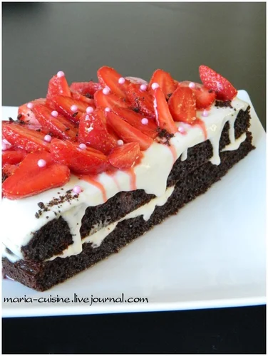

# Черёмуховый торт

#### Ингредиенты

* 2 яйца
* 100 мл молока
* 4 ст.л. сахара
* 100 гр черемуховой муки
* 4 ст.л. пшеничной муки
* 1/2 ч.л. разрыхлителя

* 250 г жирной сметаны
* сахар по вкусу

* клубника

* сироп для пропитки

#### Приготовление

Яйца взбить с сахаром, добавить молоко. Смешать сухие ингредиенты, добавить к жидким.

Вылить тесто в форму и выпекать при 180С до готовности (примерно 30 минут).

Коржи остудить и разрезать, пропитать сиропом. Я использовала гренадин.

Для крема смешать сахар и сметану, смазать им коржи.

Клубнику уложить на торт.

Приготовить наппаж из гренадина с желатином и обмазать им клубнику. Это придаст клубнике блеск, более яркий цвет и красивые подтеки торту.

*maria-cuisine.livejournal.com*