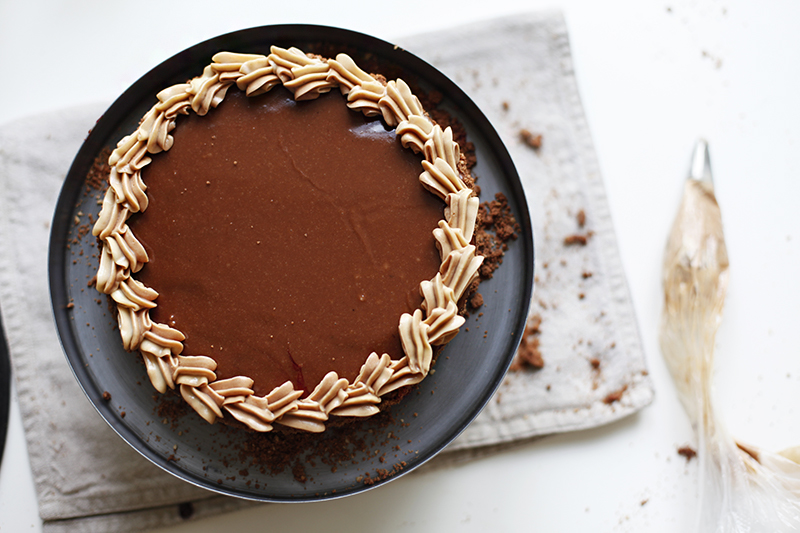

# Торт Листопад (ГОСТ)

#### Ингредиенты

форма 20 см

**тесто:**

* 300г муки
* 100г сахарной пудры
* 165г масла
* 1 яйцо (45г)
* 35г какао
* 65г ореховой муки
* щепотка соли
* 1 ч.л. разрыхлителя

**крем:**

* 160г масла
* 130г сахара
* 1желток (25г)
* 90мл молока
* 1 пакетик ванильного сахара (10г)
* 1 ст.л. коньяка
* 10г какао

**помадка:**

* 100г сахарной пудры
* 1 ч.л. какао
* 2-4 ст.л. кипятка

#### Приготовление

Приготовить песочное тесто.  
Разделить тесто на три одинаковых части. Каждую раскатать в круг на листе бумаги для выпечки так, чтобы диаметр был больше 20см.  
Положить раскатанные заготовки в морозилку на 15-20 минут.  
Выпекать коржи при 200С 12 минут. Еще горячие коржи обрезать до диаметра 20см. Обрезки сохранить. Заготовки полностью остудить, не снимая с бумаги.

Приготовить крем Шарлотт. Смешать желток с молоком, процедить, добавить сахар, ванильный сахар и нагреть на медленном огне до кипения. Загустевший сироп кипятить несколько минут, пока он не станет похожим на сгущенку. Остудить до комнатной температуры.  
Взбейте масло до посветления и добавить небольшими порциями остывший сироп, каждый раз хорошо взбивая.  
В конце взбивания добавить коньяк и какао.

Разделить крем на две равные части, отложив предварительно столовую ложку крема. Одну часть переложить в корнетик с фигурной насадкой.  
Варенье откинуть на сито, чтобы отделить 2-3 ст.л. сиропа – он понадобится для обмазки торта.

Сборка. Намазать нижний корж вареньем с ягодами.  
Накрыть средним коржом и намазать кремом.  
Накрыть верхним коржом и намазать его тонким слоем сиропа от варенья. Бока торта намазать отложенным кремом и вареньем.

Смешать и просеять сахарную пудру и какао, добавить кипяток и хорошо размешать. Помада должна быть не слишком густой, но и не жидкой.
Сразу после приготовления вылить ее на торт и быстро размазать, пока не застыла.

Обрезки от коржей измельчить и посыпать ими бока торта.

Сделать бордюр из крема. В центре торта можно уложить шоколадную стружку.

[_https://chadeyka.livejournal.com/_](https://chadeyka.livejournal.com/)

